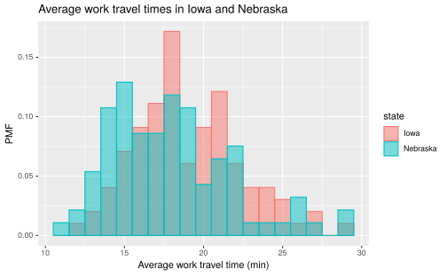
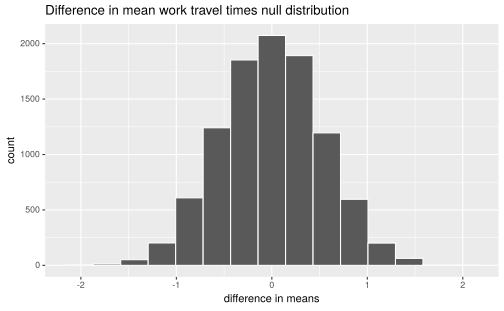
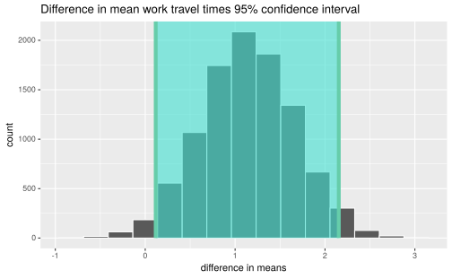

# Statistical inference with infer


## Case study: Comparing work travel times

The following is a worked example using the county complete dataset from Section \@ref(representing-distributions) that demonstrates how to use the `infer` package to test if the difference in mean values of two distributions is statistically significant.
To follow along, load the following libraries and dataset into your R session:

```r
# Packages
library(dplyr)
library(ggplot2)
library(readr)
library(infer)
# Dataset
county_complete <- read_rds(
  url("http://data.cds101.com/county_complete.rds")
)
```

### Work travel times in Iowa and Nebraska

In Section \@ref(representing-distributions), we looked at the distribution of average work travel times in Iowa and Nebraska measured on the county level.



In our visual inspection of the probability mass function, we concluded that the distribution of work travel times is shifted slightly towards shorter commutes in Nebraska versus Iowa.
The summary statistics for the two distributions seem to support this conclusion:


```r
# Filter dataset to only include counties in Iowa and Nebraska
ia_ne_county <- county_complete %>%
  filter(state == "Iowa" | state == "Nebraska")

# Compute summary statistics of mean_work_travel column for Iowa and Nebraska
ia_ne_summary_stats <- ia_ne_county %>%
  group_by(state) %>%
  summarize(
    mean = mean(mean_work_travel),
    median = median(mean_work_travel),
    sd = sd(mean_work_travel),
    iqr = IQR(mean_work_travel)
  )
```

<table class="table table-striped table-responsive" style="width: auto !important; margin-left: auto; margin-right: auto;">
 <thead>
  <tr>
   <th style="text-align:left;"> state </th>
   <th style="text-align:right;"> mean </th>
   <th style="text-align:right;"> median </th>
   <th style="text-align:right;"> sd </th>
   <th style="text-align:right;"> iqr </th>
  </tr>
 </thead>
<tbody>
  <tr>
   <td style="text-align:left;"> Iowa </td>
   <td style="text-align:right;"> 19.11 </td>
   <td style="text-align:right;"> 18.5 </td>
   <td style="text-align:right;"> 3.425 </td>
   <td style="text-align:right;"> 4.4 </td>
  </tr>
  <tr>
   <td style="text-align:left;"> Nebraska </td>
   <td style="text-align:right;"> 17.97 </td>
   <td style="text-align:right;"> 17.6 </td>
   <td style="text-align:right;"> 3.823 </td>
   <td style="text-align:right;"> 5.0 </td>
  </tr>
</tbody>
</table>

Let's compute the difference in means directly using `ia_ne_summary_stats`.
First, we need to grab the `mean` column:


```r
ia_ne_means <- ia_ne_summary_stats %>%
  pull(mean)
```

`ia_ne_means` is a simple vector that stores two numbers.


```r
ia_ne_means
```

```
## [1] 19.11 17.97
```

The first number of the vector, which we can access with `ia_ne_means[1]`, is the mean work travel times in Iowa.
The second number of the vector, which we can access with `ia_ne_means[2]`, is the mean work travel times in Nebraska.
Knowing this, we easily compute the difference in means,


```r
ia_ne_diff_in_means <- ia_ne_means[1] - ia_ne_means[2]
```

obtaining the following value of `ia_ne_diff_in_means`:


```
# (mean work travel time in Iowa) - (mean work travel time in Nebraska)
ia_ne_diff_in_means = 1.15 minutes
```

However, only checking the numerical difference between the mean values is not enough if we want to claim there is a **statistically significant** difference in commute times between Iowa and Nebraska.
There is significant overlap between the two distributions, with the standard deviation (sd) of each distribution being 3--4 times *larger* than the difference in means.
Before we can conclude that the difference in means is statistically significant, we need to estimate how likely it is that this difference could have arisen from chance alone.

### Defining the hypothesis test

To determine whether or not there is a meaningful difference in means between the two distributions, we will conduct a two-sided hypothesis test using the following null and alternative hypotheses:

*   **Null hypothesis**: There is no difference between the mean work travel time in Iowa and the mean work travel time in Nebraska.

    $$\text{H}_{0}:\mu_{\text{IA}}-\mu_{\text{NE}}=0$$

*   **Alternative hypothesis**: There is a difference between the mean work travel time in Iowa and the mean work travel time in Nebraska.
    
    $$\text{H}_{\text{A}}:\mu_{\text{IA}}-\mu_{\text{NE}}\neq{}0$$

We set our significance level to $\alpha=0.05$, which we will use as a cutoff for determining whether or not a result is statistically significant.

### Building the null distribution

To conduct our hypothesis test, we first must generate our null distribution using the `infer` package:


```r
ia_ne_mean_work_travel_null <- ia_ne_county %>%
  specify(formula = mean_work_travel ~ state) %>%
  hypothesize(null = "independence") %>%
  generate(reps = 10000, type = "permute") %>%
  calculate(stat = "diff in means", order = combine("Iowa", "Nebraska"))
```

Let's explain what each of these lines is doing.
We start by piping our filtered dataset stored in `ia_ne_county` into `specify`:

```r
specify(formula = mean_work_travel ~ state)
```

Here we *specify* the **response** variable and the **explanatory** variable in the `formula =` input keyword.
The formula syntax is given as follows:

```
response ~ explanatory
```

Therefore, in our formula `mean_work_travel ~ state`, `mean_work_travel` is the response variable and `state` is the explanatory variable.
How do we know to use `mean_work_travel` as the response variable?
It's because of how we formulated our null and alternative hypotheses, such that we are testing whether a person's mean work travel time is affected by the state he or she lives in, **not** whether the state that a person lives in is affected by his or her mean work travel time.
Finally, because the **response variable** is numerical, we don't use the `success =` keyword in `specify`.

The next line that we pipe into is:

```r
hypothesize(null = "independence")
```

Here we indicate that we are conducting a hypothesis test to check whether or not the variables provided in `specify` are independent of one another.
A basic rule of thumb is, if you specify **both** an explanatory and a response variable in the formula of `specify`, then you will use `null = "independence"`.

Next we pipe into this line:

```r
generate(reps = 10000, type = "permute")
```

Here we indicate that we want to *permute* the `mean_work_travel` and `state` columns 10,000 times to build up our null distribution.
In effect, we are randomly shuffling the rows in `mean_work_travel` into a different order, and then randomly shuffling the rows in `state` into yet another order, which should remove any connections between the `mean_work_travel` and `state` columns (this is what we mean by null distribution).
We know to use `type = "permute"` because we have specified both a response and an explanatory variable and we want to see what happens when we assume the two columns are independent.
As for `reps = 10000`, this controls the overall accuracy of our hypothesis tests.
There is no hard and fast rule for the value to set, but if you want more accurate results, increase `reps`.
However, keep in mind that the larger `reps` is, the *longer* it will take to complete the calculation.

We finish up by piping into the last line:

```r
calculate(stat = "diff in means", order = combine("Iowa", "Nebraska"))
```

Here we indicate that we are comparing the difference in means between our two distributions (the mean work travel times in Iowa and Nebraska).
The input `order = combine("Iowa", "Nebraska")` defines the subtraction order, so we will find the difference in means by subtracting the mean time in Iowa from the mean time in Nebraska, which is the same order we used for `ia_ne_diff_in_means <- ia_ne_means[1] - ia_ne_means[2]`.
As for the `stat` input, we know to use `stat = "diff in means"` because of how we formulated our null and alternative hypotheses, i.e. we are comparing the **difference** in **mean** work travel times between Iowa and Nebraska.
The way we know that we **can't** use something like `stat = "diff in props"` is because at least one of our variables in `specify` is numerical (`mean_work_travel`).
The input `stat = "diff in props"` only applies if **both** the explanatory and response variables are categorical.

The null distribution that we generated looks as follows:


```r
ia_ne_mean_work_travel_null %>%
  visualize() +
  labs(
    x = "difference in means",
    title = "Difference in mean work travel times null distribution"
  )
```



### Computing the two-sided p-value

After we've generated our null distribution, we can compute the *p*-value using `get_p_value`.
To compute a *p*-value, we need an **observed statistic**, which is simply the difference in means we computed using the dataset itself.
This is what we computed using `ia_ne_diff_in_means <- ia_ne_means[1] - ia_ne_means[2]`.
However, `infer` also provides a shortcut for computing the observed statistic so that you don't have to use `summarize()`,


```r
ia_ne_diff_in_means <- ia_ne_county %>%
  specify(formula = mean_work_travel ~ state) %>%
  calculate(stat = "diff in means", order = combine("Iowa", "Nebraska"))
```

Note that all we've done is taken the code we used to generate the null distribution and removed the `hypothesize()` and `generate()` lines.
Now that we have our observed statistic, we can compute the *p*-value for our **two-sided hypothesis test**,


```r
ia_ne_p_value_two_sided <- ia_ne_mean_work_travel_null %>%
  get_p_value(obs_stat = ia_ne_diff_in_means, direction = "both")
```

<table class="table table-striped table-responsive" style="width: auto !important; margin-left: auto; margin-right: auto;">
 <thead>
  <tr>
   <th style="text-align:right;"> p_value </th>
  </tr>
 </thead>
<tbody>
  <tr>
   <td style="text-align:right;"> 0.029 </td>
  </tr>
</tbody>
</table>

Our two-sided p-value is 0.029, which is below our significance level of $\alpha=0.05$. We therefore reject the null hypothesis in favor of the alternative hypothesis. The difference between the mean work travel times in Iowa and Nebraska is statistically significant.

We visualize the meaning of the *p*-value in the following way:


```r
ia_ne_mean_work_travel_null %>%
  visualize() +
  shade_p_value(obs_stat = ia_ne_diff_in_means, direction = "both") +
  labs(
    x = "difference in means",
    title = "Difference in mean work travel times null distribution"
  )
```


The portions of the null distribution that are in the shaded red area correspond to results that are **more extreme** than the observed value 1.15 in a two-sided hypothesis test.
The more that a null distribution lies within the red portions of the visualization, the more likely it becomes that we will fail to reject the null distribution and the difference in means that we observed in the dataset arose due to random chance alone.

### Computing the 95% confidence interval

In addition to the two-sided hypothesis test, it is also good practice to compute the 95% confidence interval for the difference in mean work travel times between Iowa and Nebraska.
To compute this, we need to generate the **bootstrap distribution** for the difference in means:


```r
ia_ne_mean_work_travel_bootstrap <- ia_ne_county %>%
  specify(formula = mean_work_travel ~ state) %>%
  generate(reps = 10000, type = "bootstrap") %>%
  calculate(stat = "diff in means", order = combine("Iowa", "Nebraska"))
```

You'll notice that the code to generate the bootstrap distribution is pretty similar to the code used to generate the null distribution.
All we had to do was remove the `hypothesize(null = "independence")` line and change the `type =` keyword in `generate` from `"permute"` to `"bootstrap"`, and that's it!

You might be wondering, how are the methods for generating the null distribution and bootstrap distribution different?
For this example, they differ in two important ways:

1.  Unlike when we generated the null distribution, the `mean_work_travel` and `state` columns are **not** randomly shuffled

2.  Generating a bootstrap distribution requires *sampling with replacement*, meaning we grab different rows in `ia_ne_county` at random (we might even grab the same row more than), which we do not do if we permute the columns

The bootstrap distribution we just generated looks as follows:


```r
ia_ne_mean_work_travel_bootstrap %>%
  visualize() +
  labs(
    x = "difference in means",
    title = "Difference in mean work travel times bootstrap distribution"
  )
```


This shows what could happen if we went out and collected another set of samples of the data in this dataset.
Due to random variations in the people we survey, sometimes we might end up with a dataset where the difference between the mean work travel times in Iowa and Nebraska is closer to 2 minutes instead of 1 minute, or it might be closer to zero.
Most of the time, it will be close to 1 minute.

The 95% confidence interval is defined as the fraction of the data in the bootstrap distribution that lies between the 2.5th and 97.5th percentiles:


```r
ia_ne_ci95 <- ia_ne_mean_work_travel_bootstrap %>%
  get_confidence_interval()
```

<table class="table table-striped table-responsive" style="width: auto !important; margin-left: auto; margin-right: auto;">
 <thead>
  <tr>
   <th style="text-align:right;"> lower_ci </th>
   <th style="text-align:right;"> upper_ci </th>
  </tr>
 </thead>
<tbody>
  <tr>
   <td style="text-align:right;"> 0.1167 </td>
   <td style="text-align:right;"> 2.153 </td>
  </tr>
</tbody>
</table>

This means that, if we keep collecting new samples of mean work travel times in Iowa and Nebraska, we expect that 95% of our samples will have a difference in mean work travel times that lies between 0.1167 and 2.1534.
Also note that the lower bound of the confidence interval does not intersect with a difference of means equal to zero, lending further support to the conclusion we reached using our two-sided hypothesis test.

We close this example by visualizing the 95% confidence interval by shading the middle 95% of the data in the bootstrap distribution:


```r
ia_ne_mean_work_travel_bootstrap %>%
  visualize() +
  shade_confidence_interval(endpoints = ia_ne_ci95) +
  labs(
    x = "difference in means",
    title = "Difference in mean work travel times 95% confidence interval"
  )
```


