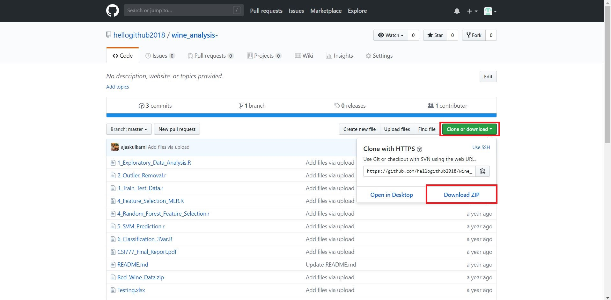

```{r setup, include = FALSE}
# DO NOT ALTER THIS CHUNK
knitr::opts_chunk$set(
  echo = FALSE, eval = TRUE, fig.width = 5,
  fig.asp = 0.618, out.width = "100%", dpi = 120,
  fig.align = "center", cache = TRUE, dev = "svg"
)
```

In this tutorial, we will learn how to create, import and download repository from GitHub.

## Creating a repository

### Step - 1

We saw in the last tutorial that after creating an account on GitHub, there are three ways to create a repository. The most common method of creating a repository is to click on "+" sign and then click on "New repository" option. 

```{r step_1}
knitr::include_graphics("img/repository_step_1.jpg")
```

### Step - 2

After clicking on "New repository" you will go to a new screen where you need to give a repository name. You will also find two options to either keep repository as public or private. In the end, there will be another option to initialize the repository with Readme.md file.  

```{r step_2}
knitr::include_graphics("img/repository_step_2.jpg")
```

### Step - 3

GitHub doesn't allow to create a repository without a name. Thus, it is mandatory to give a name to the repository. After providing all the details and selecting appropriate options click on "Create repository" button. 

```{r step_3}
knitr::include_graphics("img/repository_step_3.jpg")
```

### Step - 4

In this way, the repository will be successfully created. If you have ticked on initializing the repository with Readme.md file, then you will find the file in the repository. You can easily edit Readme.md file by clicking on the file.

```{r step_4}
knitr::include_graphics("img/repository_step_4.jpg")
```

### Step - 5

After clicking Readme.md file if you want to add any content in that file then click on the pencil symbol. Click on "Commit" button after making changes in the file.

```{r step_5}
knitr::include_graphics("img/repository_step_5.jpg")
```

## Importing a repository

### Step - 1

To import repository from other account click on "+" sign and then click on "Import repository" option. After that, you need to provide a link of other repository which you need to clone or import and the repository name to store on your GitHub account. After giving all the details click on "Begin import" button. 

```{r step_6}
knitr::include_graphics("img/repository_step_6.jpg")
```

### Step - 2

The import process will start, and you will get a notification after completion of the import process. 

```{r step_7}
knitr::include_graphics("img/repository_step_7.jpg")
```

### Step - 3

In the end, you will be able to see the imported repository in your GitHub account.

```{r step_8}
knitr::include_graphics("img/repository_step_8.jpg")
```

## Downloading a repository 

The simplest way to download any repository on GitHub is to click on that repository and then click on "Clone or download" button. After that, a menu will appear and then click on "Download ZIP" option. In this way, you will be able to download any repository on your local drive. 

```{r step_9}

```
