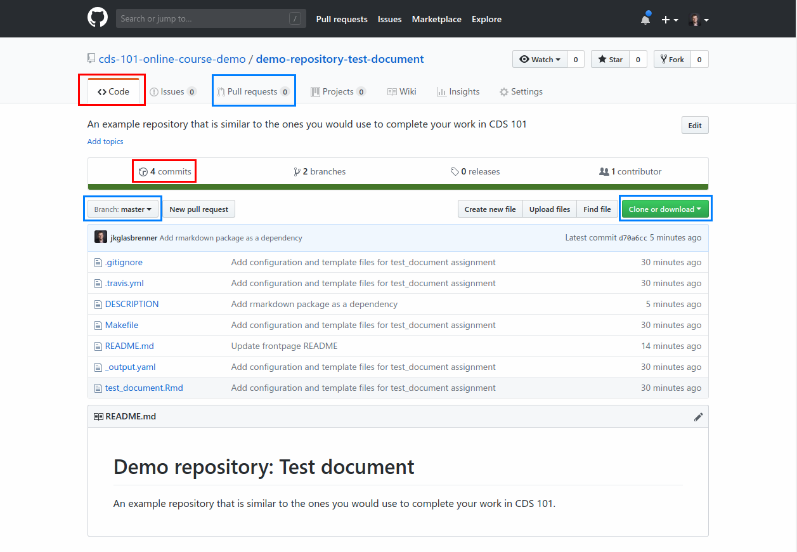
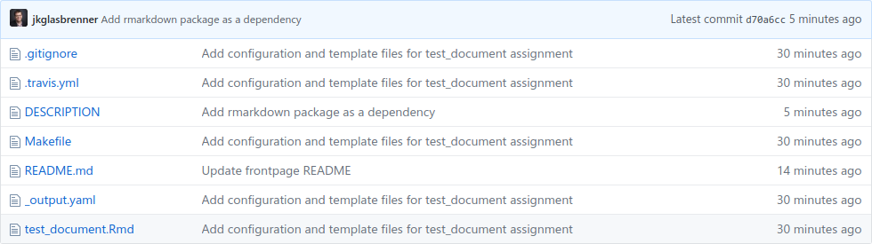
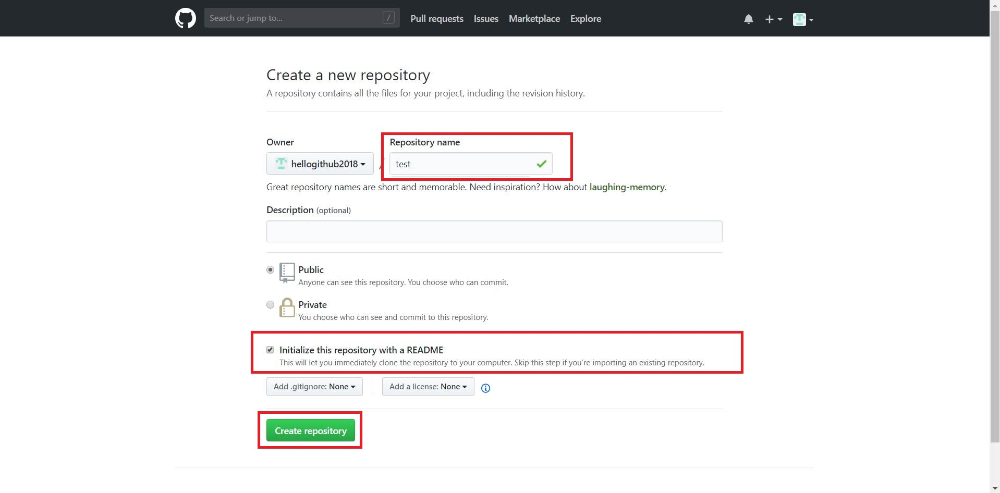
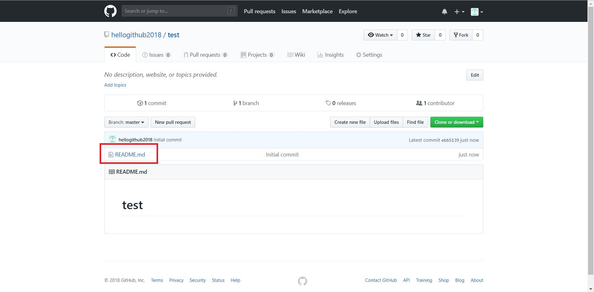
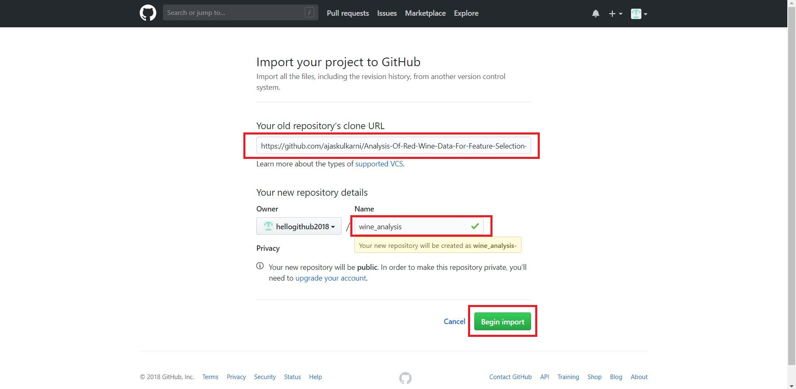

# GitHub

```{r setup, include = FALSE}
knitr::opts_chunk$set(
  echo = FALSE,
  eval = TRUE,
  out.width = "100%"
)
```

## Getting started 

### Account sign-up {#github-signup}

To create an account on GitHub, begin by launching your web browser and navigate to <https://github.com/>.

```{r signup-step_1, click.img = TRUE}
knitr::include_graphics("img/signup_step_1.jpg")
```

In the signup form, enter your **your Mason `@gmu.edu` email address**, a username, and a password, and then click on the "sign up for GitHub" button

```{r signup-step_2, click.img = TRUE}
knitr::include_graphics("img/signup_step_2.jpg")
```

After creating the account on GitHub, you will see a new page containing details about plans for repositories.
Keep the default options and click on the "Continue" button.

```{r signup-step_3, click.img = TRUE}
knitr::include_graphics("img/signup_step_3.jpg")
```

The next page asks you to provide information about your programming experience and other details.
This is optional.
To skip this step, click on the "skip this step" link.
Otherwise, once you are done entering the information, click the "Submit" button.

```{r signup-step_4, click.img = TRUE}
knitr::include_graphics("img/signup_step_4.jpg")
```

Your Github account is now created and you will be greeted with the welcome page.
You will also receive an email about account verification.
Please click on the link in the email to verify your account.

```{r signup-step_5, click.img = TRUE}
knitr::include_graphics("img/signup_step_5.jpg")
```

### Joining the class organization {#join-class-org}

The next step after creating your account is to join the course organization.
You should have received an email with a link to join the class organization on GitHub at the start of this semester.

You should receive an email from the course instructor to join the class organization on GitHub at the start of the semester.
In that email, there will be a link you need to click in order to join the organization.

```{r signup-step_6, click.img = TRUE}
knitr::include_graphics("img/signup_step_6.jpg")
```

If you cannot find the email, please contact your course instructor.

After clicking the link, you may be greeted with this page.

```{r signup-step_7, click.img = TRUE}
knitr::include_graphics("img/signup_step_7.jpg")
```

This means your browser doesn't remember your sign-in, or you haven't signed up yet, which you should now do if that's the case.
If you have an account, then click the sign-in link at the bottom and enter your username and password.
Once you are logged in, you will be asked to approve the necessary permissions so that you can join the class organization, which you should do.

## Navigating the GitHub site

For your convenience, the course website contains links taking you directly to course content stored on GitHub.
However, you may prefer to access your existing content by navigating the GitHub site itself, so let's take a short tour of the GitHub interface.

### Main dashboard {#github-navigation-main-dashboard}

When you will login into GitHub for the first time you will see the main dashboard for the website.

```{r navigating-step_1, click.img = TRUE}
knitr::include_graphics("img/dashboard_first_icons.jpg")
```

At the top of the dashboard there are several buttons, boxes, and icons that you can click in order to navigate the site.
Starting from the left,

*   **GitHub icon**: This is similar to the "Home" or "Main" buttons found on other websites.
    Clicking this icon brings you back to your currently active dashboard, which is what we're already viewing.

*   **Search bar**: Used to look for content on the GitHub site, such as repositories and user accounts, just click it and start typing.

*   **Pull requests**, **Issues**, **Marketplace**, and **Explore**: Of these links, the only one you might use for the course is "Pull requests", however we'll save the discussion about Pull requests for another time. 

*   **Bell icon**: This displays your account notifications, such as when someone tags your username.

*   **Plus icon**: Used for creating content, such as creating a new repository.

The last icon on the right is your profile picture, and clicking it opens up another menu containing some additional links.

```{r navigating-step_3_2, click.img = TRUE}
knitr::include_graphics("img/navigating_step_3_2.jpg")
```

From this menu you can reach your profile, account settings, the help section, and a couple other of other pages.
Let's take a quick look to see what the profile and settings pages look like.

### Profile page

Clicking **Your profile** will take you to your account's profile page.

```{r github-account-page, click.img = TRUE}
knitr::include_graphics("img/repository_step_8.jpg")
```

Since you most likely have a new account, there won't be much here right now.
If you click the **Repositories** tab at the top of your profile, it will display a list of repositories associated with your account, *however keep in mind that it will not have any content you work on for the class*.
This is important to keep in mind when you are looking for your files!

### Settings

Clicking **Settings** takes you to the account settings page where you can inspect and update your account settings.
Use the menu on the left to choose the setting you would like to change.

```{r github-settings-menu, click.img = TRUE, out.width = "219px"}
knitr::include_graphics("img/github_account_settings_menu.png")
```

For now you may want to upload a profile picture or add a short bio under the **Profile** setting.
You can also change how the site sends you email updates and notification alerts under the **Emails** and **Notifications** settings.

### Class organization page

Returning to the main dashboard, after you've joined the class organization and started using the site some more, your dashboard will begin to look more like this.

```{r github-dashboard-dropdown-menu, click.img = TRUE}
knitr::include_graphics("img/dashboard_dropdown_menu.png")
```

As we learned while looking at the profile page, your classwork will not be visible there.
Instead, you will need to navigate to the class organization in order to find your files for the class, so let's do that now.
Click the gray icon with your username on the left side of the page, as outlined in the above screenshot, which will open up a dropdown menu.

```{r github-dashboard-dropdown-menu-open, click.img = TRUE, out.width = "303px"}
knitr::include_graphics("img/dashboard_dropdown_menu_opened.png")
```

This menu lists all the GitHub organizations your account belongs to, and you can identify our class organization as it will have `cds-101` somewhere in its name.
Clicking the class organization in the menu will bring you to the *class organization dashboard*.

```{r github-dashboard-course-organization, click.img = TRUE}
knitr::include_graphics("img/dashboard_course_organization.png")
```

The dashboard is similar to the dashboard we saw earlier, but it will only contain content associated with the class.
On the left you will see a list of some of your class repositories, which you can filter by typing in the *Find a repository...* search box.
If you don't see any repositories there, don't worry, we will get around to creating them soon enough!

To see a full list of your class repositories, similar to the repositories tab on your profile page, click the **View organization** button on the upper right of the page.

```{r github-course-organization-repo-list, click.img = TRUE}
knitr::include_graphics("img/course_organization_repo_list.png")
```

Here you should be able to find all of the repositories that you've used during the class.

::::: {.alert .alert-warning}
<span class="h4">Keep in mind</span>

If you click the **GitHub icon** while you are accessing content in the class organization, *it will bring you back to the class organization dashboard, not the [main dashboard](#github-navigation-main-dashboard) we saw earlier*.
To get back to the main dashboard, click the gray icon with the class organization name and then click your username in the dropdown menu.
:::::

## Repositories

```{r demo-repo-tabs-and-buttons, click.img = TRUE}

```

```{r demo-repo-files-list, click.img = TRUE}

```

```{r repo-files-windows-folder, click.img = TRUE}
knitr::include_graphics("img/repo_files_windows_folder.png")
```

```{r demo-repo-readme-box, click.img = TRUE}
knitr::include_graphics("img/demo_repo_readme_box.png")
```

## Additional topics

### How to create a repository

We saw in the last tutorial that after creating an account on GitHub, there are three ways to create a repository. The most common method of creating a repository is to click on "+" sign and then click on "New repository" option.

```{r getting-to-know-step_1, click.img = TRUE}
knitr::include_graphics("img/repository_step_1.jpg")
```

After clicking on "New repository" you will go to a new screen where you need to give a repository name. You will also find two options to either keep repository as public or private. In the end, there will be another option to initialize the repository with Readme.md file.

```{r getting-to-know-step_2, click.img = TRUE}
knitr::include_graphics("img/repository_step_2.jpg")
```

GitHub doesn't allow to create a repository without a name. Thus, it is mandatory to give a name to the repository. After providing all the details and selecting appropriate options click on "Create repository" button.

```{r getting-to-know-step_3, click.img = TRUE}

```

In this way, the repository will be successfully created. If you have ticked on initializing the repository with Readme.md file, then you will find the file in the repository. You can easily edit Readme.md file by clicking on the file.

```{r getting-to-know-step_4, click.img = TRUE}

```

After clicking Readme.md file if you want to add any content in that file then click on the pencil symbol. Click on "Commit" button after making changes in the file.

```{r getting-to-know-step_5, click.img = TRUE}
knitr::include_graphics("img/repository_step_5.jpg")
```

### How to import a repository

To import repository from other account click on "+" sign and then click on "Import repository" option. After that, you need to provide a link of other repository which you need to clone or import and the repository name to store on your GitHub account. After giving all the details click on "Begin import" button.

```{r getting-to-know-step_6, click.img = TRUE}

```

The import process will start, and you will get a notification after completion of the import process.

```{r getting-to-know-step_7, click.img = TRUE}
knitr::include_graphics("img/repository_step_7.jpg")
```

In the end, you will be able to see the imported repository in your GitHub account.

```{r getting-to-know-step_8, click.img = TRUE}
knitr::include_graphics("img/repository_step_8.jpg")
```

## Creating and adding an SSH key to your Github account

In this tutorial, we will learn step by step how to create and add an SSH key to your GitHub account.

Log in to your RStudio Server account on <https://rstudio.cos.gmu.edu/>. When RStudio Server will start then click on "Tools" option in the menu bar and then click on "Global Options..."

```{r ssh-key-step_1, click.img = TRUE}
knitr::include_graphics("img/SSH_Step_1.jpg")
```

After clicking "Global Options..." you will see a new window containing different options. From that window click on "Git/SVN" which will be present on the left side and then click on "Create RSA key".

```{r ssh-key-step_2, click.img = TRUE}
knitr::include_graphics("img/SSH_Step_2.jpg")
```

A new window will open, and there will be two textboxes. One textbox will be for entering a passphrase, and other will be for confirmation. Adding a passphrase will be an optional part. After that click on "Create" button and a new window will appear containing information about RSA key pair. Now, you can close that window by clicking on "Close" button.

```{r ssh-key-step_3, click.img = TRUE}
knitr::include_graphics("img/SSH_Step_3.jpg")
```

```{r ssh-key-step_4, click.img = TRUE}
knitr::include_graphics("img/SSH_Step_4.jpg")
```

Click on the "View public key" option which will open another new window containing public key. After opening that window copy the public key and close the window.

```{r ssh-key-step_5, click.img = TRUE}
knitr::include_graphics("img/SSH_Step_5.jpg")
```

```{r ssh-key-step_6, click.img = TRUE}
knitr::include_graphics("img/SSH_Step_6.jpg")
```

In the last step, we successfully generated a public key. Now, we need to add that public key to our GitHub account. To do that go to <https://github.com/> and login to your account. After logging in click on your profile picture and then click on "Settings" option in the list.

```{r ssh-key-step_7, click.img = TRUE}
knitr::include_graphics("img/SSH_Step_7.jpg")
```

You will see a list of options to configure your GitHub account. Now from the list click on "SSH and GPG keys" option.

```{r ssh-key-step_8, click.img = TRUE}
knitr::include_graphics("img/SSH_Step_8.jpg")
```

There will be two sections SSH keys and GPG keys. Click on "New SSH key" button.

```{r ssh-key-step_9, click.img = TRUE}
knitr::include_graphics("img/SSH_Step_9.jpg")
```

After clicking "New SSH key" button, we need to specify details of SSH key. In the first textbox, you need to give a title to the key and in the second textbox paste the copied key. After entering these details click on "Add SSH key" button.

```{r ssh-key-step_10, click.img = TRUE}
knitr::include_graphics("img/SSH_Step_10.jpg")
```

If all the steps were followed correctly, then you will see a key in SSH keys section.

```{r ssh-key-step_11, click.img = TRUE}
knitr::include_graphics("img/SSH_Step_11.jpg")
```

**If you have any questions or concerns, then please contact your instructor.**
