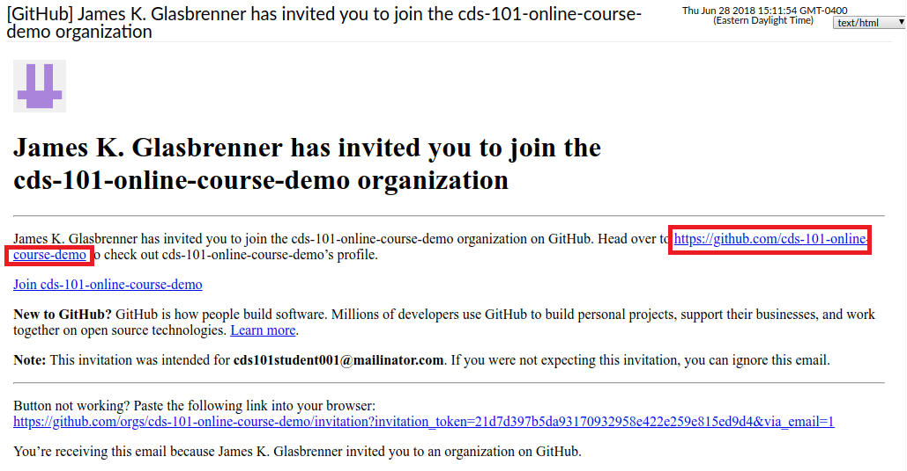
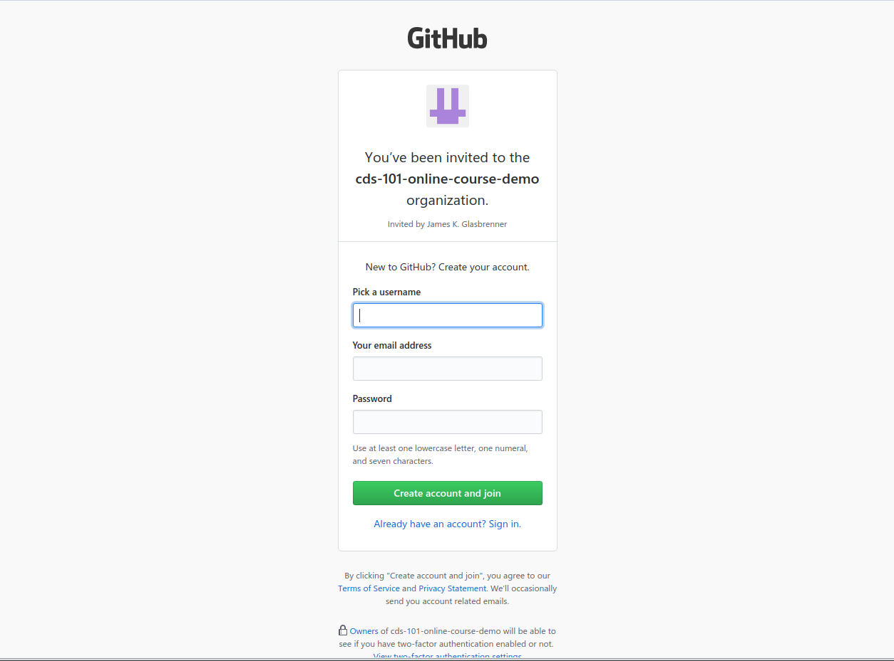

```{r setup, include = FALSE}
# DO NOT ALTER THIS CHUNK
knitr::opts_chunk$set(
  echo = FALSE, eval = TRUE, fig.width = 5,
  fig.asp = 0.618, out.width = "100%", dpi = 120,
  fig.align = "center", cache = TRUE, dev = "svg"
)
```

There are two options to signup for GitHub. The first option is to create GitHub account manually and the other option is to click on the link from the email which your instructor has provided. In this tutorial, we will go through both the options.

## Option - 1 (Manual account creation)

### Step - 1

To create an account on GitHub, you need to visit <https://github.com/>.

```{r step_1}
knitr::include_graphics("img/signup_step_1.jpg")
```

### Step - 2

In this step, you need to register on GitHub by providing your email address and then creating username as well as the password for your account. After providing all the details, please click on the "sign up for GitHub" button

```{r step_2}
knitr::include_graphics("img/signup_step_2.jpg")
```

### Step - 3

After creating the account on GitHub, a new window will appear containing details about plans for repositories. Please keep the options default and click on the "Continue" button.

```{r step_3,}
knitr::include_graphics("img/signup_step_3.jpg")
```

### Step - 4

This step is an optional step, and you can skip this step by clicking on "skip this step" link. If you want to provide information about your programming experience and other details, then you can provide details in this step. After entering all the information, please click the "Submit" button.

```{r step_4}
knitr::include_graphics("img/signup_step_4.jpg")
```

After performing all the above steps, your account will be successfully created on GitHub and you will be able to see the welcome page. You will also receive an email about account verification. Please click on the link which you will receive in the email to verify your account. 

```{r step_5}
knitr::include_graphics("img/signup_step_5.jpg")
```

## Option - 2 (Email from the instructor)

### Step - 1

You will receive an email from the instructor to join the organization on GitHub. In that email, there will be a link which you need to click for joining the organization.

```{r step_6}

```

### Step - 2

After clicking the link if you don't have an account on GitHub then you need to create that and you will see the sign-up screen. After that, you need to follow all the steps which are mentioned in Option - 1. If you already have an account on GitHub, then GitHub will ask your permissions, and then you can directly join the organization. 

```{r step_7}

```

