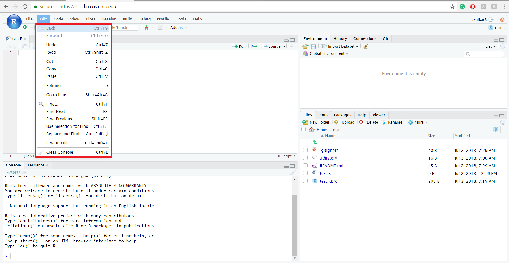
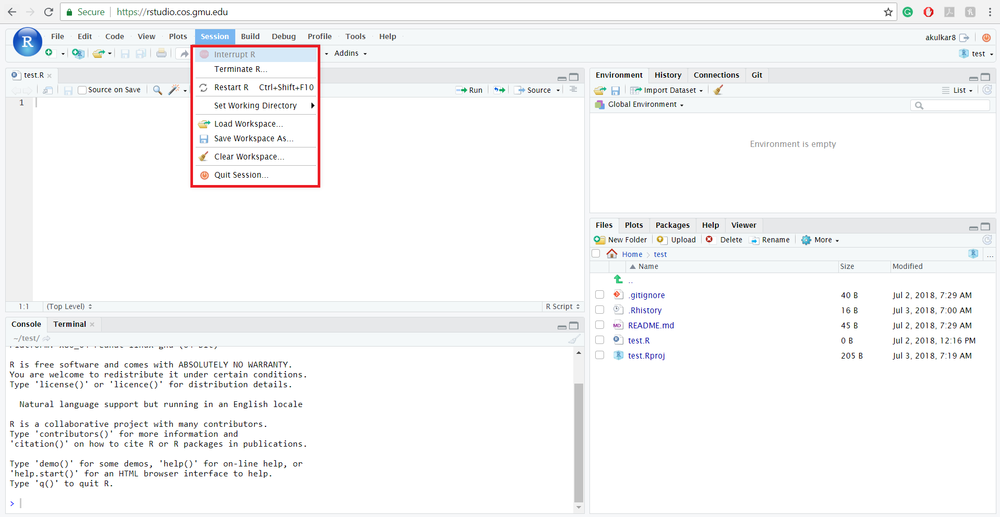
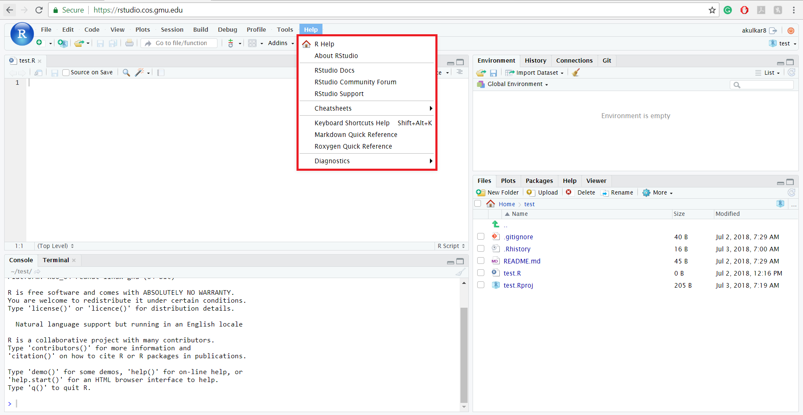

In the last tutorial, we learned how to log in into RStudio Server. In this tutorial, we will understand the different options and their uses which RStudio Server provides.  

```{r setup, include = FALSE}
# DO NOT ALTER THIS CHUNK
knitr::opts_chunk$set(
  echo = FALSE, eval = TRUE, fig.width = 5,
  fig.asp = 0.618, out.width = "100%", dpi = 120,
  fig.align = "center", cache = TRUE, dev = "svg"
)
```

### RStudio Server sub-windows

When you log in into RStudio Server, you will be able to see four sub-windows. 

* The upper left window is for creating, running, and saving scripts which consist of a series of commands that are to be executed in sequence. This window is also used for viewing data sets.

* The window at the lower left is the Console, where individual commands are entered and executed, and the results are shown. When a script is run from the editor, the output will appear in the Console window.

* The window at the upper right shows available data sets and objects when the Environment tab is selected, and it shows previously run commands when the History button is selected. It also provides you information about connections and Git.

* The window at the lower right shows files and folders in the user's R folder in the image below, but this window also is used to display Help responses, and for displaying graphs and plots generated by R.  

```{r step_1}
knitr::include_graphics("img/tour_step_1.jpg")
```

### File tab

The RStudio File menu contains many of the standard functions of a File menu in any other software or program – New File, Open File, Save, Print. You can also Knit a document by selecting Knit document option from file tab. 

```{r step_2}
knitr::include_graphics("img/tour_step_2.jpg")
```

### Edit tab

Using Edit menu users can perform Cut, Copy, Paste, Undo, and Redo. The Edit menu is also very helpful in locating code or commands previously used. Featuring Go to Line…, Find…, and Replace and Find, users can quickly edit or replace RStudio code. The Edit menu additionally has the command Clear Console which allows users to wipe the Console clean. Clear Console does not affect the Source, Environment/History, or Miscellaneous tabs. 

```{r step_3}

```

### Code tab

The Code menu has commands used for working with code. Similar to the Edit menu, Code offers Jump To… for quick access to a specific code. Here you can rework the appearance of your code with Reformat Code, and where functions and variables may be removed with Extract Function and Extract Variable. The Code menu also provides commands for running the code with Run Selected Line(s), Re-Run Previous, and Run Region.

```{r step_4}
knitr::include_graphics("img/tour_step_4.jpg")
```

### View tab

The View menu is focused on how the user sees their RStudio workspace. This menu allows you to choose which tab you want to view, as well as where the mouse should be focused. Panes focus on zoom abilities of RStudio and enable users to zoom in on a specific tab.

```{r step_5}
knitr::include_graphics("img/tour_step_5.jpg")
```

### Plots tab

The Plots menu works specifically with plots that you have made in RStudio. This menu allows you to quickly switch between plots and zoom on the plot to enhance clarity. This is where you can choose to save your plot as either an image or a PDF, as well as where you may delete unwanted plots with Remove Plot….

```{r step_6}
knitr::include_graphics("img/tour_step_6.jpg")
```

### Session tab

The Session menu allows users to open a New Session… and Quit Session…. Here you may also Terminate R… if you are finished with using RStudio, or Restart R if an update needs to occur or the program needs to be refreshed.

```{r step_7}

```

### Build tab

The Build menu features only one command: Configure Build Tools. Build Tools may only be configured inside of an RStudio project and are a way to package and distribute R code.

```{r step_8}
knitr::include_graphics("img/tour_step_8.jpg")
```

### Debug tab

The Debug menu is what ensures your code is working correctly. When there is an error in your code or commands, the Debug menu will point out the errors and allow you to decide if you wish to keep working with your RStudio code. You may choose how you wish to be notified of an error by using the option "On Error". If you need additional help fixing an error, select Debugging Help.

```{r step_9}
knitr::include_graphics("img/tour_step_9.jpg")
```

### Proflie tab

The Profile menu allows users to understand better what exactly RStudio is doing. Profiling provides a graphical interface so that users may see what RStudio is working on in moments when you are waiting for output to appear. By profiling, users can learn what is slowing their code so that they may tweak parts to make the code run faster.

```{r step_10}
knitr::include_graphics("img/tour_step_10.jpg")
```

### Tools tab

The Tools menu provides information on the current version of RStudio being run, as well as being the location where Packages and Addins may be installed. Tools also assist RStudio users with Keyboard Shortcuts and allow users to Modify Keyboard Shortcuts to cater to individual’s needs and preferences.

```{r step_11}
knitr::include_graphics("img/tour_step_11.jpg")
```

### Help tab

The Help menu provides information to assist users to maximize their RStudio proficiency. Direct links to RStudio Help are provided, as well as Cheatsheets made by RStudio professionals and a section on Diagnostics to allow the user to see what is occurring in RStudio.

```{r step_12}

```

### References

* <http://sphweb.bumc.bu.edu/otlt/MPH-Modules/QuantCore/PH717-R-Basics/PH717-R-Basics3.html>
* <https://wp.stolaf.edu/it/rstudio-menu-bar/>
