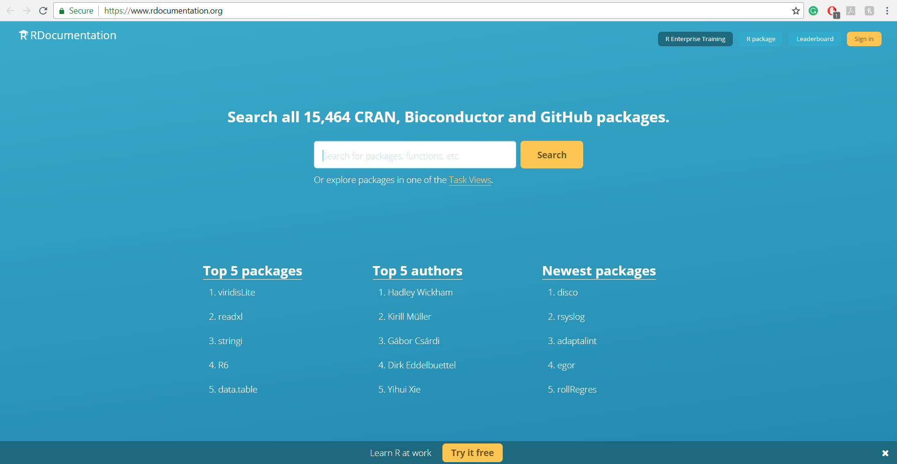

```{r setup, include = FALSE}
# DO NOT ALTER THIS CHUNK
knitr::opts_chunk$set(
  echo = FALSE, eval = TRUE, fig.width = 5,
  fig.asp = 0.618, out.width = "100%", dpi = 120,
  fig.align = "center", cache = TRUE, dev = "svg"
)
```

The help and documentation for R and RStudio Server are readily available in RStudio Server. In RStudio Server if you click on Help tab, then you will get a menu for selecting an option.  

```{r step_1}
knitr::include_graphics("img/help_step_1.jpg")
```

If you click on R Help then in the lower right window you will get all the help for R as well as for RStudio. You can also search for any topic using the search box. 

```{r step_2}
knitr::include_graphics("img/help_step_2.jpg")
```

If you want specific documentation for RStudio, then you need to click on RStudio docs. It will open a new tab in your browser and provide you with all the documentation. 

```{r step_3}
knitr::include_graphics("img/help_step_3.jpg")
```

R documentation is also available on <https://www.rdocumentation.org/> website. You can find information about packages, functions and different parameters on R documentation website.

```{r step_5}

```

RStudio also provide cheatsheets for help. In help tab, if you click on Cheatsheets option, then you will get another menu of available cheatsheets in RStudio.

```{r step_4}
knitr::include_graphics("img/help_step_4.jpg")
```

You can also find more resources (for data science, RStudio, etc.,) on RStudio website. Please visit <https://www.rstudio.com/resources> for more resources. 

```{r step_6}
knitr::include_graphics("img/help_step_6.jpg")
```

**If you have any questions or stuck at any point, then please contact your instructor for the help.** 
