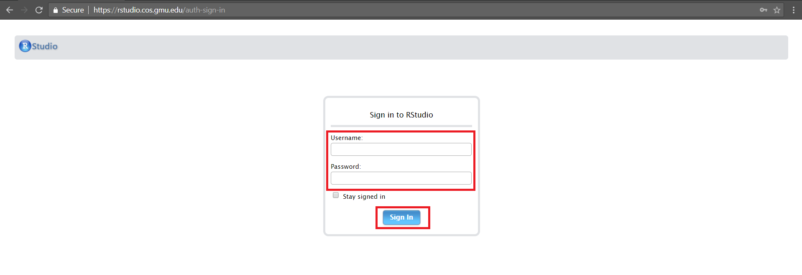

```{r setup, include = FALSE}
# DO NOT ALTER THIS CHUNK
knitr::opts_chunk$set(
  echo = FALSE, eval = TRUE, fig.width = 5,
  fig.asp = 0.618, out.width = "100%", dpi = 120,
  fig.align = "center", cache = TRUE, dev = "svg"
)
```

To log in to your RStudio Server account, you need to go to RStudio Server authentication page <https://rstudio.cos.gmu.edu/auth-sign-in>. On that page, you need to provide username and password of your Patriot web account. If you want to stay signed in, then click on the checkbox. After entering details click on "Sign In".

```{r step_1}

```

You have successfully logged in to your RStudio Server account, and you will find a similar screen (given below) in your web browser. 

```{r step_2}
knitr::include_graphics("img/login_step_2.jpg")
```

