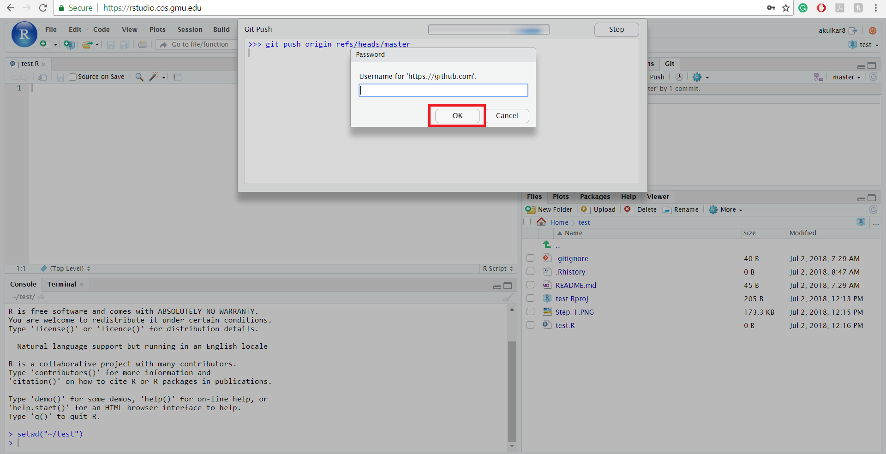
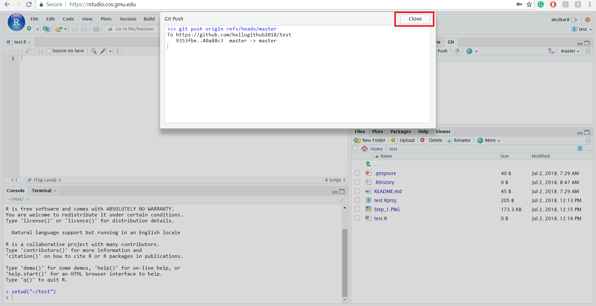

```{r setup, include = FALSE}
# DO NOT ALTER THIS CHUNK
knitr::opts_chunk$set(
  echo = FALSE, eval = TRUE, fig.width = 5,
  fig.asp = 0.618, out.width = "100%", dpi = 120,
  fig.align = "center", cache = TRUE, dev = "svg"
)
```

### Step - 1

Log in to your RStudio Server account on <https://rstudio.cos.gmu.edu/>. You can see the current repository in which you are working to the upper right corner. To push files on GitHub from RStudio Server you can create a new file by clicking on "File" option, or you can also upload the files from your local drive to RStudio Server.  

```{r step_1}
knitr::include_graphics("img/stage_step_1.jpg")
```

### Step - 2

When you click on the "Upload" button, then you will get a new window to upload the files. Click on "Choose File" button to select file and then click on "Ok". You can upload only one file at a time. So, if you want to upload multiple files, then please create a ".zip" file and then upload. 

```{r step_2}
knitr::include_graphics("img/stage_step_2.jpg")
```

### Step - 3

After uploading the files or creating a file in RStudio Server, you will be able to see those files in the lower right window. Click on the "Git" which is present in the upper right window. After clicking the Git button, you will find the recently uploaded or created file there.

```{r step_3}
knitr::include_graphics("img/stage_step_3.jpg")
```

### Step - 4

Click on the "Staged" checkbox to stage files which you want to push to GitHub and click on the "Commit".

```{r step_4}
knitr::include_graphics("img/stage_step_4.jpg")
```

### Step - 5

A new window will open, and it will reflect you the files which you want to commit to GitHub repository. You can also write a commit message in the "Commit message" textbox and then click the "Commit" button.

```{r step_5}
knitr::include_graphics("img/stage_step_5.jpg")
```

You will see the following screen after clicking on the "Commit" button. Close the window by clicking the "Close" button. 

```{r step_6}
knitr::include_graphics("img/stage_step_6.jpg")
```

### Step - 6

After committing the files on GitHub, you will find the upper right window empty. It means that you have committed the files to the repository. Now, in the final step, you need to click on "Push" to push the files in the repository. 

```{r step_7}
knitr::include_graphics("img/stage_step_7.jpg")
```

### Step - 7

When you click the "Push" button, then RStudio Server will ask you for your GitHub username and password. Please give your details and then click on "Ok".

```{r step_8}

```

In the end, you will see a new window containing Git Push message. If everything is correct, then there will not be any errors, and your files have been successfully pushed in GitHub repository. 

```{r step_9}

```

### Step - 8 (Optional)

You can also crosscheck on GitHub by accessing the specific repository. 

```{r step_10}
knitr::include_graphics("img/stage_step_10.jpg")
```

In this way, you can easily stage, commit and push to GitHub using RStudio Server. If you have any questions or concerns, then please contact your advisor.
