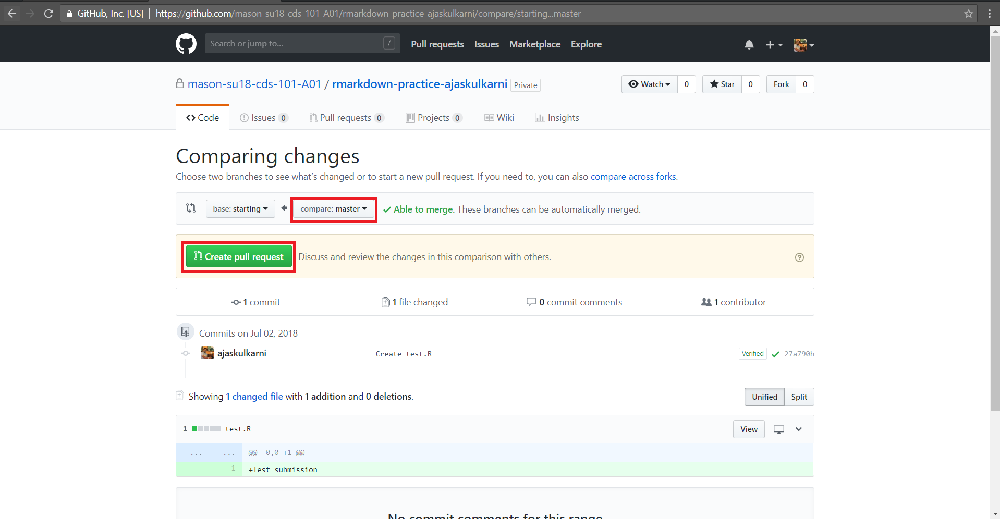

```{r setup, include = FALSE}
# DO NOT ALTER THIS CHUNK
knitr::opts_chunk$set(
  echo = FALSE, eval = TRUE, fig.width = 5,
  fig.asp = 0.618, out.width = "100%", dpi = 120,
  fig.align = "center", cache = TRUE, dev = "svg"
)
```

### Step - 1

Log in to your GitHub account on <https://github.com/> and go into the repository which you would like to submit. Click the "Pull Requests" tab near the top of the page. 

```{r step_1}
knitr::include_graphics("img/pull_step_1.jpg")
```

### Step - 2

Click the green button that says "New pull request".

```{r step_2}
knitr::include_graphics("img/pull_step_2.jpg")
```

### Step - 3

Click the drop-down menu button labeled "base:", and select the option starting.

```{r step_3}
knitr::include_graphics("img/pull_step_3.jpg")
```

### Step - 4

Confirm that the drop-down menu button labeled "compare:" is set to master and click the green button that says “Create pull request”.

```{r step_4}

```

### Step - 5

Give the pull request the following title: Submission: Homework 1/2/3/4, FirstName LastName, replacing FirstName and LastName with your actual first and last name. 

In the message box, write: My homework submission is ready for grading @jkglasbrenner and click "Create pull request" to lock in your submission.

```{r step_5}
knitr::include_graphics("img/pull_step_5.jpg")
```

### Step - 6

After submitting the pull request, you will able to see the title and message which you wrote for submission.  

```{r step_6}
knitr::include_graphics("img/pull_step_6.jpg")
```
