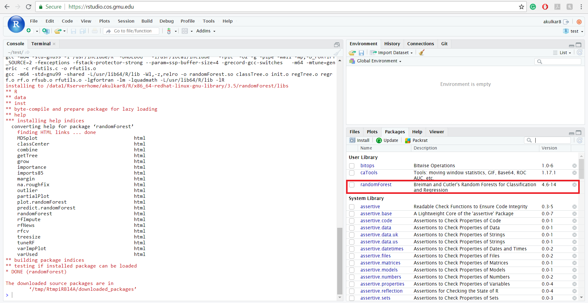

```{r setup, include = FALSE}
# DO NOT ALTER THIS CHUNK
knitr::opts_chunk$set(
  echo = FALSE, eval = TRUE, fig.width = 5,
  fig.asp = 0.618, out.width = "100%", dpi = 120,
  fig.align = "center", cache = TRUE, dev = "svg"
)
```

There are two ways to install and update the packages on RStudio Server. We will learn both the techniques in this tutorial. 

### Option - 1 (Without commands)

This is the easiest option to install and update the packages on RStudio Server. You can find a list of all the installed packages on RStudio Server by clicking the Packages tab (present in the lower right window) and then to install any package click on the Install button.

```{r step_1}
knitr::include_graphics("img/packages_step_1.jpg")
```

RStudio Server will then open a new window to insert the package name which you need to install. After entering package name click on the Install button. 

```{r step_2}
knitr::include_graphics("img/packages_step_2.jpg")
```

After clicking the Install button, RStudio Server will install the package, and you will be able to see the newly installed package in the list.

```{r step_3}

```

To import any package click on the checkbox of the package. RStudio Server will automatically import the package which you have selected. Similarly to update packages you need to click on the update tab, and RStudio Server will give you a  list of packages which are outdated and ask your permission to update. 

```{r step_4}
knitr::include_graphics("img/packages_step_4.jpg")
```

### Option - 2 (With commands)

You can also install and update packages by typing commands in RStudio Server Console. To install any package on RStudio Server, you need to use **install.packages("PackageName")** command in R. Example of installing "ROCR" package is shown below. The package which you need to install will get replaced by "ROCR". Also, after installing any package, the list also gets updated. (R also installs the dependent packages if needed when you install any package).

```{r step_5}
knitr::include_graphics("img/packages_step_5.jpg")
```

To import any package in RStudio Server, you need to use **library(PacakageName)** command. Below an example of importing "ROCR" package is shown. In R, many times package gets imported along with its dependent packages.

To update all the outdated packages  **update.packages(ask = FALSE)** command is used. If you do not include **ask = False** then RStudio Server will ask your permission every time while updating the package.

```{r step_6}
knitr::include_graphics("img/packages_step_6.jpg")
```
