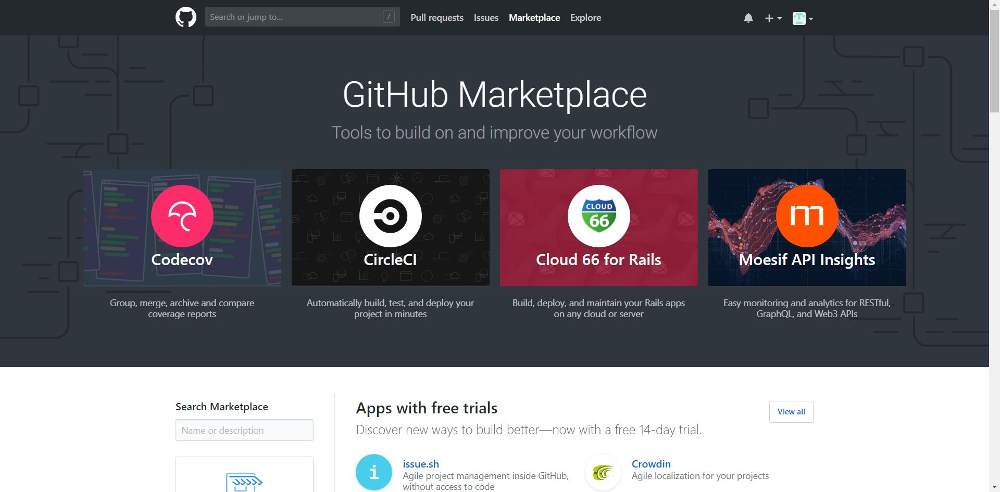
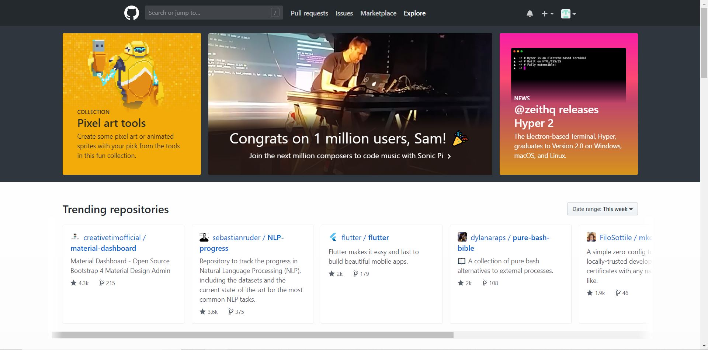

```{r setup, include = FALSE}
# DO NOT ALTER THIS CHUNK
knitr::opts_chunk$set(
  echo = FALSE, eval = TRUE, fig.width = 5,
  fig.asp = 0.618, out.width = "100%", dpi = 120,
  fig.align = "center", cache = TRUE, dev = "svg"
)
```

In the first tutorial, we created an account on GitHub. Now in this tutorial, we will get information about different options present on the dashboard. When you will login into GitHub you will be able to see the following screen.  

```{r step_1}
knitr::include_graphics("img/navigating_step_1.jpg")
```

On the dashboard, there is a search box that can be used to search any repositories which are available on GitHub. Also, there are different options like Pull requests, Issues, Marketplace and Explore.  

When you click on the Pull requests option, you will get information about pull requests which you have created as well as you have assigned. It will also give you information about open and closed pull requests. Issues option helps to provide keep track of bugs, enhancements, or other requests. Marketplace option contains tools and services that complement and improve your workflow. There are different tools in the Marketplace for maintaining code quality, code review, deployment, etc. The Explore option provides details about trending repositories, popular topics, popular marketplace apps, etc. 

```{r step_2}
knitr::include_graphics("img/navigating_step_2.jpg")
```

GitHub Marketplace option
```{r step_2_1}

```

GitHub Explore option
```{r step_2_2}

```

The next option is bell icon, and it shows the notifications of your GitHub account. The "+" icon is used for creating or importing a repository or for the creation of new gist or organization. You can also create a new repository by clicking on "Start a project" button or "New repository" button. 

```{r step_3_1}
knitr::include_graphics("img/navigating_step_3_1.jpg")
```

Users can also change their account settings by clicking on the profile picture. After clicking on the profile picture, GitHub will present you a menu and user can select appropriate option as per their requirement. In that menu, there is a help option which contains articles from GitHub about different topics. 

```{r step_3_2}
knitr::include_graphics("img/navigating_step_3_2.jpg")
```

Github also provides basic tutorials, and they can be accessed by clicking on "Read the guide" button. You can also access video guides on YouTube <https://www.youtube.com/githubguides> 

Reference - <https://help.github.com/articles>
