# RStudio Server

```{r setup, include = FALSE}
knitr::opts_chunk$set(
  echo = FALSE,
  eval = TRUE,
  out.width = "100%"
)
```

## Big picture overview of RStudio Server

### RStudio

> RStudio is an integrated development environment (IDE) for R. It includes a console, syntax-highlighting editor that supports direct code execution, as well as tools for plotting, history, debugging and workspace management. RStudio is available in open source and commercial editions and runs on the desktop (Windows, Mac, and Linux) or in a browser connected to RStudio Server or RStudio Server Pro (Debian/Ubuntu, RedHat/CentOS, and SUSE Linux). RStudio team also contributes code to many R packages like Shiny, tidyverse, rmarkdown, etc.

### RStudio Server

> RStudio Server is a product of RStudio which can be accessed via web browser. You can access RStudio Server by authenticating on <https://rstudio.cos.gmu.edu>. Some of the essential features of RStudio Server are given below,

> * Integrates the tools you use with R into a single environment.
> * Includes powerful coding tools designed to enhance your productivity.
> * Enables rapid navigation to files and functions.
> * Make it easy to start new or find existing projects.
> * Provides integrated support for Git and Subversion.
> * Supports authoring HTML, PDF, Word Documents, and slideshows.
> * Supports interactive graphics with Shiny and ggvis.

### Reference

* <https://www.rstudio.com>

<!-- ## How to login to RStudio Server -->

<!-- To log in to your RStudio Server account, you need to go to RStudio Server authentication page <https://rstudio.cos.gmu.edu/auth-sign-in>. On that page, you need to provide username and password of your Patriot web account. If you want to stay signed in, then click on the checkbox. After entering details click on "Sign In". -->

<!-- ```{r login_step_1} -->
<!-- knitr::include_graphics("img/login_step_1.png") -->
<!-- ``` -->

<!-- You have successfully logged in to your RStudio Server account, and you will find a similar screen (given below) in your web browser.  -->

<!-- ```{r login_step_2} -->
<!-- 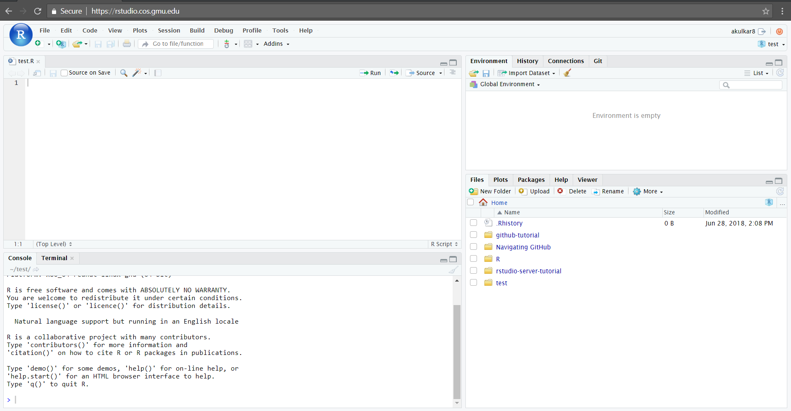 -->
<!-- ``` -->

## A guided tour of RStudio Server's default interface

In the last tutorial, we learned how to log in into RStudio Server. In this tutorial, we will understand the different options and their uses which RStudio Server provides.

### RStudio Server sub-windows

When you log in into RStudio Server, you will be able to see four sub-windows. 

* The upper left window is for creating, running, and saving scripts which consist of a series of commands that are to be executed in sequence. This window is also used for viewing data sets.

* The window at the lower left is the Console, where individual commands are entered and executed, and the results are shown. When a script is run from the editor, the output will appear in the Console window.

* The window at the upper right shows available data sets and objects when the Environment tab is selected, and it shows previously run commands when the History button is selected. It also provides you information about connections and Git.

* The window at the lower right shows files and folders in the user's R folder in the image below, but this window also is used to display Help responses, and for displaying graphs and plots generated by R.  

```{r tour_step_1}
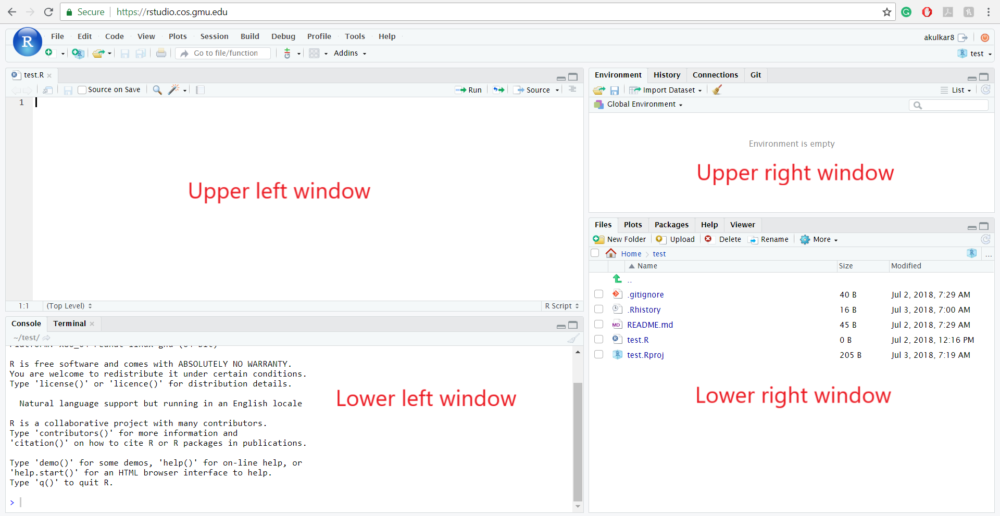
```

### File tab

The RStudio File menu contains many of the standard functions of a File menu in any other software or program – New File, Open File, Save, Print. You can also Knit a document by selecting Knit document option from file tab. 

```{r tour_step_2}
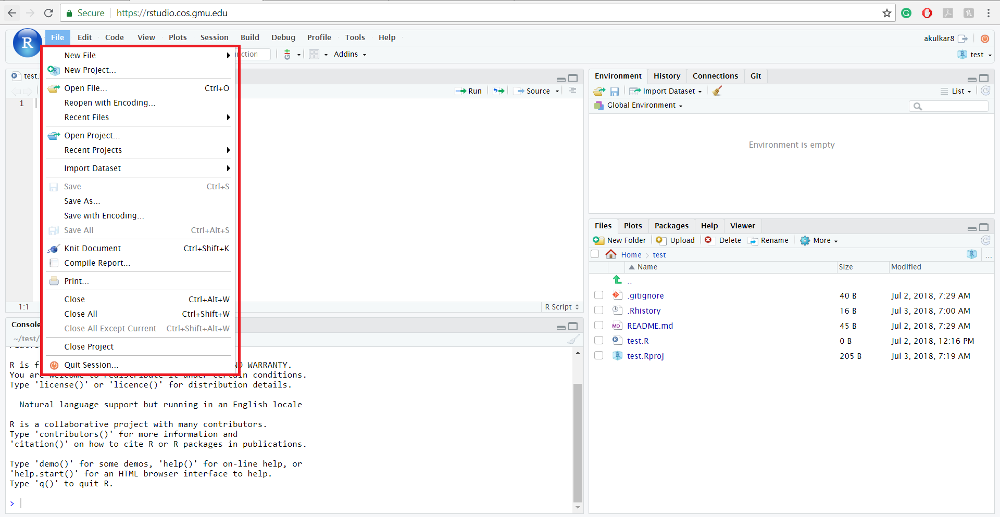
```

### Edit tab

Using Edit menu users can perform Cut, Copy, Paste, Undo, and Redo. The Edit menu is also very helpful in locating code or commands previously used. Featuring Go to Line…, Find…, and Replace and Find, users can quickly edit or replace RStudio code. The Edit menu additionally has the command Clear Console which allows users to wipe the Console clean. Clear Console does not affect the Source, Environment/History, or Miscellaneous tabs. 

```{r tour_step_3}
knitr::include_graphics("img/tour_step_3.png")
```

### Code tab

The Code menu has commands used for working with code. Similar to the Edit menu, Code offers Jump To… for quick access to a specific code. Here you can rework the appearance of your code with Reformat Code, and where functions and variables may be removed with Extract Function and Extract Variable. The Code menu also provides commands for running the code with Run Selected Line(s), Re-Run Previous, and Run Region.

```{r tour_step_4}
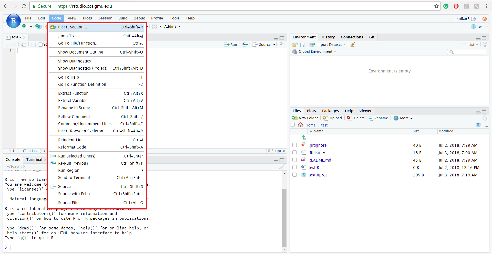
```

### View tab

The View menu is focused on how the user sees their RStudio workspace. This menu allows you to choose which tab you want to view, as well as where the mouse should be focused. Panes focus on zoom abilities of RStudio and enable users to zoom in on a specific tab.

```{r tour_step_5}
knitr::include_graphics("img/tour_step_5.png")
```

### Plots tab

The Plots menu works specifically with plots that you have made in RStudio. This menu allows you to quickly switch between plots and zoom on the plot to enhance clarity. This is where you can choose to save your plot as either an image or a PDF, as well as where you may delete unwanted plots with Remove Plot….

```{r tour_step_6}
knitr::include_graphics("img/tour_step_6.png")
```

### Session tab

The Session menu allows users to open a New Session… and Quit Session…. Here you may also Terminate R… if you are finished with using RStudio, or Restart R if an update needs to occur or the program needs to be refreshed.

```{r tour_step_7}
knitr::include_graphics("img/tour_step_7.png")
```

### Build tab

The Build menu features only one command: Configure Build Tools. Build Tools may only be configured inside of an RStudio project and are a way to package and distribute R code.

```{r tour_step_8}
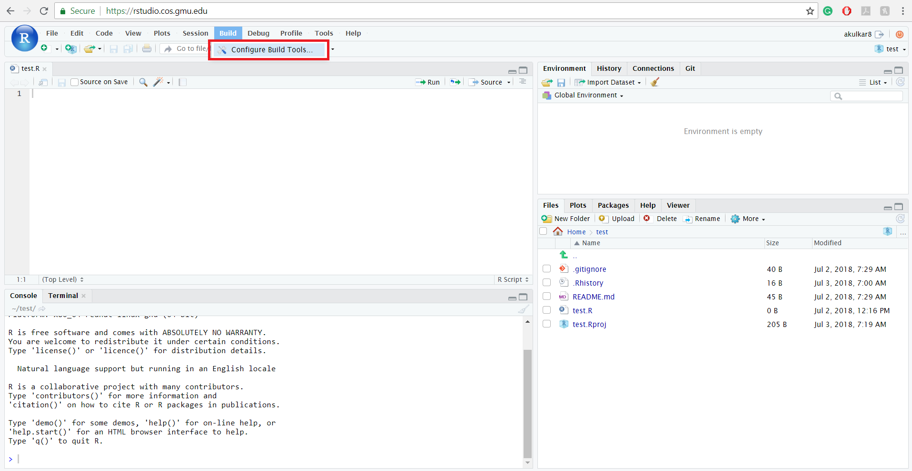
```

### Debug tab

The Debug menu is what ensures your code is working correctly. When there is an error in your code or commands, the Debug menu will point out the errors and allow you to decide if you wish to keep working with your RStudio code. You may choose how you wish to be notified of an error by using the option "On Error". If you need additional help fixing an error, select Debugging Help.

```{r tour_step_9}
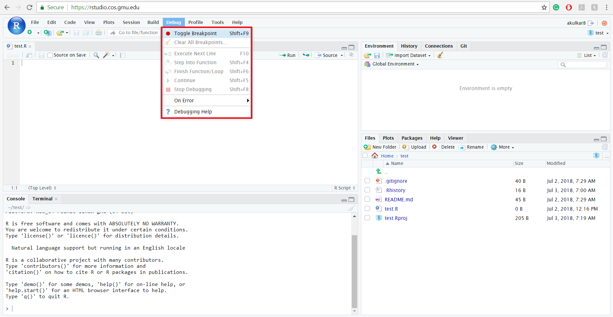
```

### Proflie tab

The Profile menu allows users to understand better what exactly RStudio is doing. Profiling provides a graphical interface so that users may see what RStudio is working on in moments when you are waiting for output to appear. By profiling, users can learn what is slowing their code so that they may tweak parts to make the code run faster.

```{r tour_step_10}
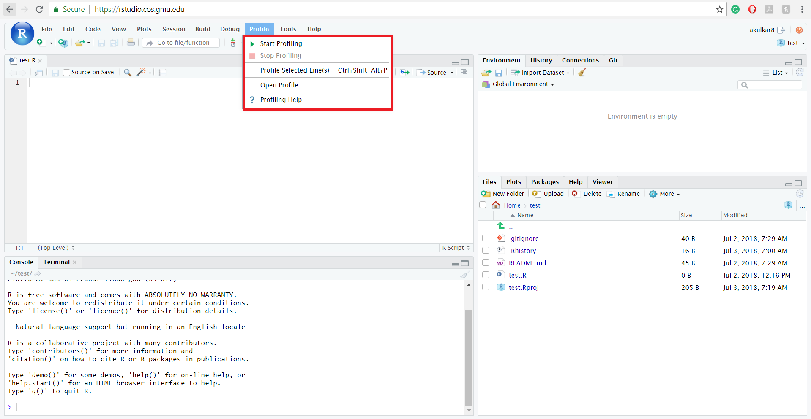
```

### Tools tab

The Tools menu provides information on the current version of RStudio being run, as well as being the location where Packages and Addins may be installed. Tools also assist RStudio users with Keyboard Shortcuts and allow users to Modify Keyboard Shortcuts to cater to individual’s needs and preferences.

```{r tour_step_11}
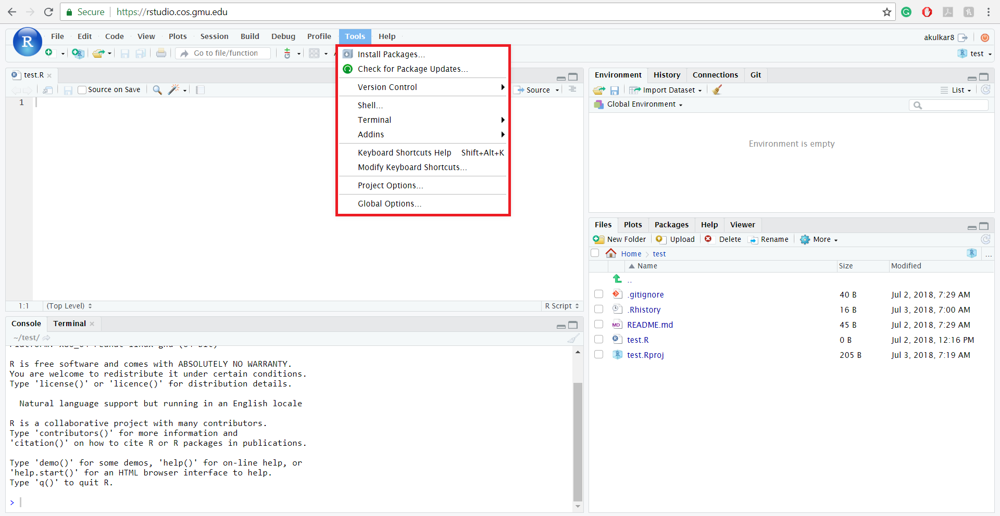
```

### Help tab

The Help menu provides information to assist users to maximize their RStudio proficiency. Direct links to RStudio Help are provided, as well as Cheatsheets made by RStudio professionals and a section on Diagnostics to allow the user to see what is occurring in RStudio.

```{r tour_step_12}
knitr::include_graphics("img/tour_step_12.png")
```

### References

* <http://sphweb.bumc.bu.edu/otlt/MPH-Modules/QuantCore/PH717-R-Basics/PH717-R-Basics3.html>
* <https://wp.stolaf.edu/it/rstudio-menu-bar/>

## Help and documentation for R and RStudio Server

The help and documentation for R and RStudio Server are readily available in RStudio Server. In RStudio Server if you click on Help tab, then you will get a menu for selecting an option.  

```{r help_step_1}
knitr::include_graphics("img/help_step_1.png")
```

If you click on R Help then in the lower right window you will get all the help for R as well as for RStudio. You can also search for any topic using the search box. 

```{r help_step_2}
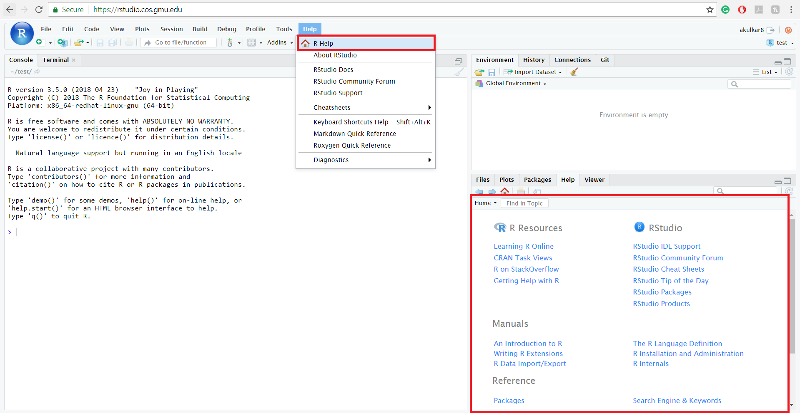
```

If you want specific documentation for RStudio, then you need to click on RStudio docs. It will open a new tab in your browser and provide you with all the documentation. 

```{r help_step_3}
knitr::include_graphics("img/help_step_3.png")
```

R documentation is also available on <https://www.rdocumentation.org/> website. You can find information about packages, functions and different parameters on R documentation website.

```{r help_step_5}
knitr::include_graphics("img/help_step_5.png")
```

RStudio also provide cheatsheets for help. In help tab, if you click on Cheatsheets option, then you will get another menu of available cheatsheets in RStudio.

```{r help_step_4}
knitr::include_graphics("img/help_step_4.png")
```

You can also find more resources (for data science, RStudio, etc.,) on RStudio website. Please visit <https://www.rstudio.com/resources> for more resources. 

```{r help_step_6}
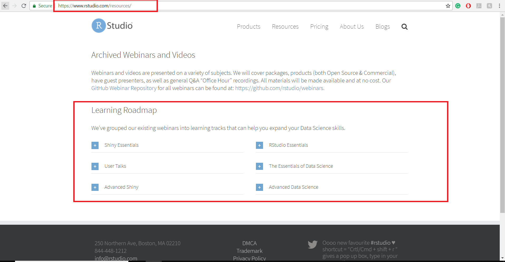
```

**If you have any questions or stuck at any point, then please contact your instructor for the help.** 


## Initial Set-up

### Install required packages

Before starting any of the assignments for the class, you need to install a set of extensions to R (called packages).

In the console tab, type:

`install.packages("tidyverse")`

and hit enter. This will take several minutes to finish, and you will see many lines of text flash past on the screen. The installation is finished when the console returns to the prompt symbol: `>`


### Change Global Options

To change the settings for RStudio Server, click Tools > Global Options… in the top menu bar. A pop-up menu will appear with many different options for you to change. You are free to explore all the different options on your own. For now, there are two things you should change:

* Uncheck the box next to **Restore .RData into workspace at startup**

* Click the drop-down menu next to **Save workspace to .RData on exit** and change the setting to *Never*

Click the **Apply** button on the lower-right of the pop-up window, followed by the **OK** button.


### Configure RStudio for use with Git

In the bottom left pane, click on the *Terminal* tab.

Wait for the prompt to load (it can take 10-20 seconds). When it appears, the prompt will end with a dollar symbol: `$`

At the prompt, type and run two separate commands (replacing with the email you used to sign up for GitHub, and your name). Keep the quotation marks around these values.

`git config --global user.email "you@gmu.edu"`

`git config --global user.name "Your Name"`


And you’re done.


## Installing and updating R packages on RStudio Server

There are two ways to install and update the packages on RStudio Server. We will learn both the techniques in this tutorial. 

### Option - 1 (Without commands)

This is the easiest option to install and update the packages on RStudio Server. You can find a list of all the installed packages on RStudio Server by clicking the Packages tab (present in the lower right window) and then to install any package click on the Install button.

```{r packages_step_1}
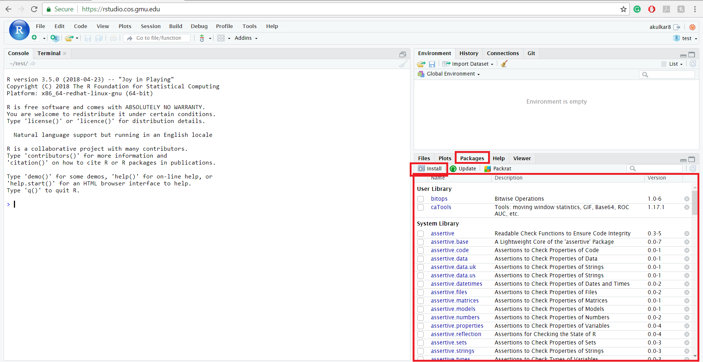
```

RStudio Server will then open a new window to insert the package name which you need to install. After entering package name click on the Install button. 

```{r packages_step_2}
knitr::include_graphics("img/packages_step_2.png")
```

After clicking the Install button, RStudio Server will install the package, and you will be able to see the newly installed package in the list.

```{r packages_step_3}
knitr::include_graphics("img/packages_step_3.png")
```

To import any package click on the checkbox of the package. RStudio Server will automatically import the package which you have selected. Similarly to update packages you need to click on the update tab, and RStudio Server will give you a  list of packages which are outdated and ask your permission to update. 

```{r packages_step_4}
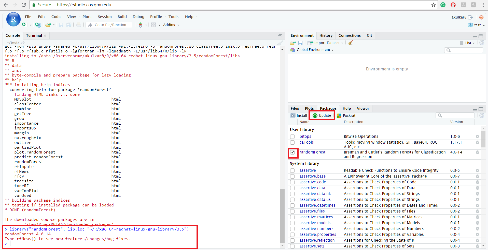
```

### Option - 2 (With commands)

You can also install and update packages by typing commands in RStudio Server Console. To install any package on RStudio Server, you need to use **install.packages("PackageName")** command in R. Example of installing "ROCR" package is shown below. The package which you need to install will get replaced by "ROCR". Also, after installing any package, the list also gets updated. (R also installs the dependent packages if needed when you install any package).

```{r packages_step_5}
knitr::include_graphics("img/packages_step_5.png")
```

To import any package in RStudio Server, you need to use **library(PacakageName)** command. Below an example of importing "ROCR" package is shown. In R, many times package gets imported along with its dependent packages.

To update all the outdated packages  **update.packages(ask = FALSE)** command is used. If you do not include **ask = False** then RStudio Server will ask your permission every time while updating the package.

```{r packages_step_6}
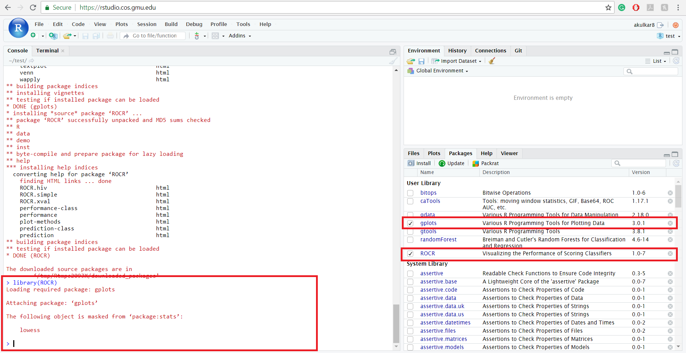
```

## Creating and adding an SSH key to your Github account

In this tutorial, we will learn step by step how to create and add an SSH key to your GitHub account.

Log in to your RStudio Server account on <https://rstudio.cos.gmu.edu/>. When RStudio Server will start then click on "Tools" option in the menu bar and then click on "Global Options..."

```{r ssh-key-step_1, click.img = TRUE}
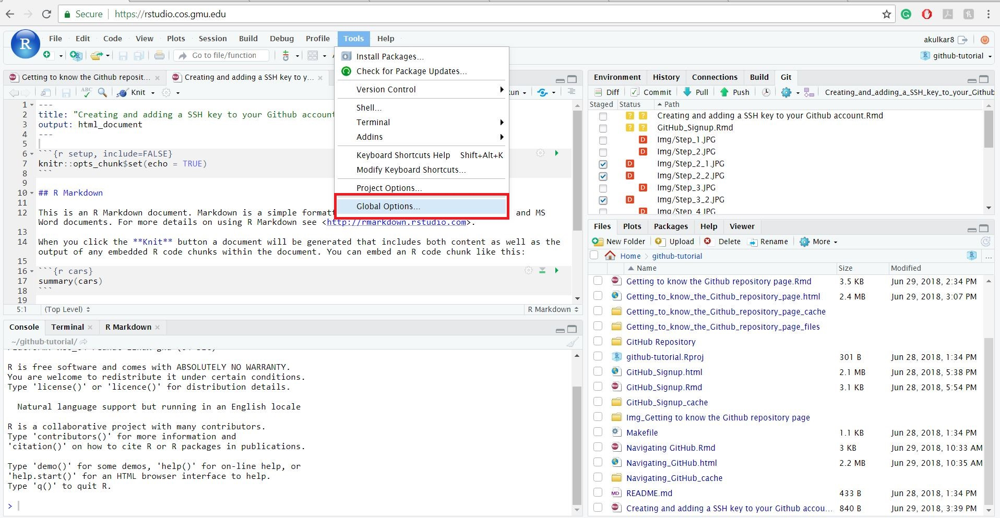
```

After clicking "Global Options..." you will see a new window containing different options. From that window click on "Git/SVN" which will be present on the left side and then click on "Create RSA key".

```{r ssh-key-step_2, click.img = TRUE}
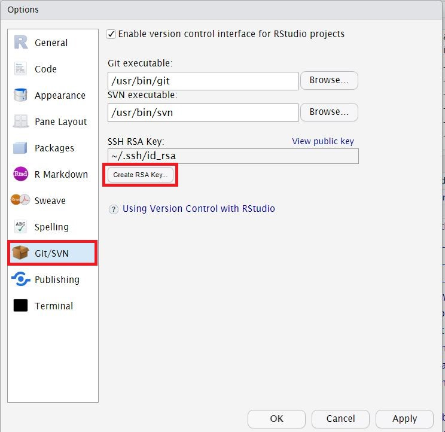
```

A new window will open, and there will be two textboxes. One textbox will be for entering a passphrase, and other will be for confirmation. Adding a passphrase will be an optional part. After that click on "Create" button and a new window will appear containing information about RSA key pair. Now, you can close that window by clicking on "Close" button.

```{r ssh-key-step_3, click.img = TRUE}
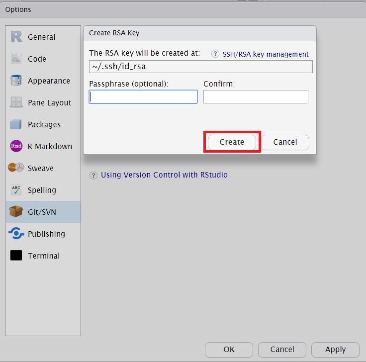
```

```{r ssh-key-step_4, click.img = TRUE}
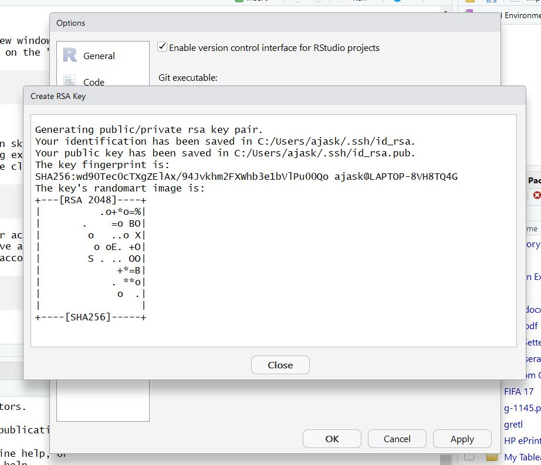
```

Click on the "View public key" option which will open another new window containing public key. After opening that window copy the public key and close the window.

```{r ssh-key-step_5, click.img = TRUE}
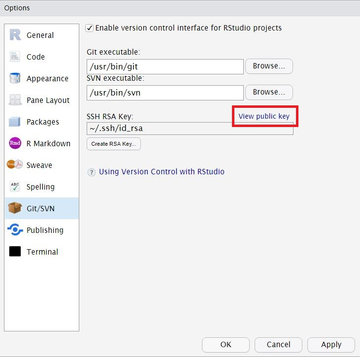
```

```{r ssh-key-step_6, click.img = TRUE}
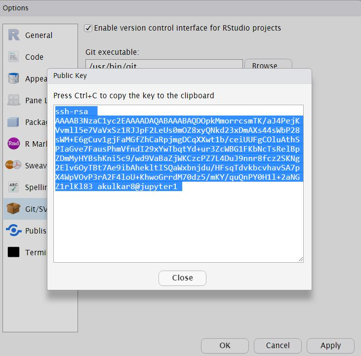
```

In the last step, we successfully generated a public key. Now, we need to add that public key to our GitHub account. To do that go to <https://github.com/> and login to your account. After logging in click on your profile picture and then click on "Settings" option in the list.

```{r ssh-key-step_7, click.img = TRUE}
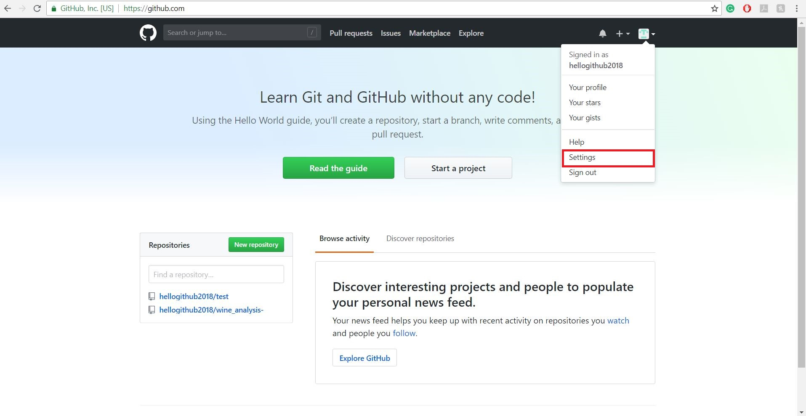
```

You will see a list of options to configure your GitHub account. Now from the list click on "SSH and GPG keys" option.

```{r ssh-key-step_8, click.img = TRUE}
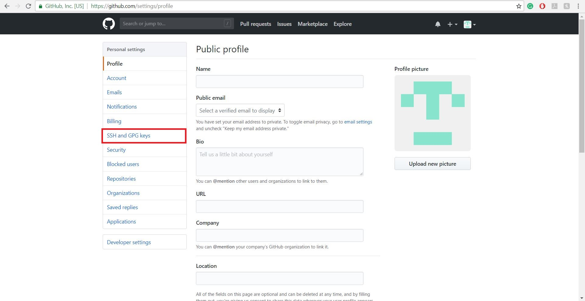
```

There will be two sections SSH keys and GPG keys. Click on "New SSH key" button.

```{r ssh-key-step_9, click.img = TRUE}
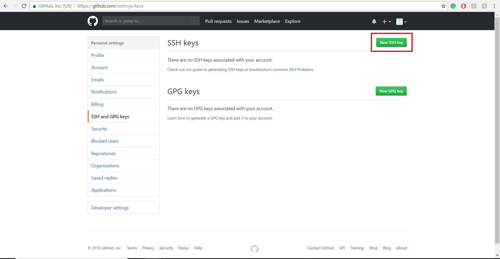
```

After clicking "New SSH key" button, we need to specify details of SSH key. In the first textbox, you need to give a title to the key and in the second textbox paste the copied key. After entering these details click on "Add SSH key" button.

```{r ssh-key-step_10, click.img = TRUE}
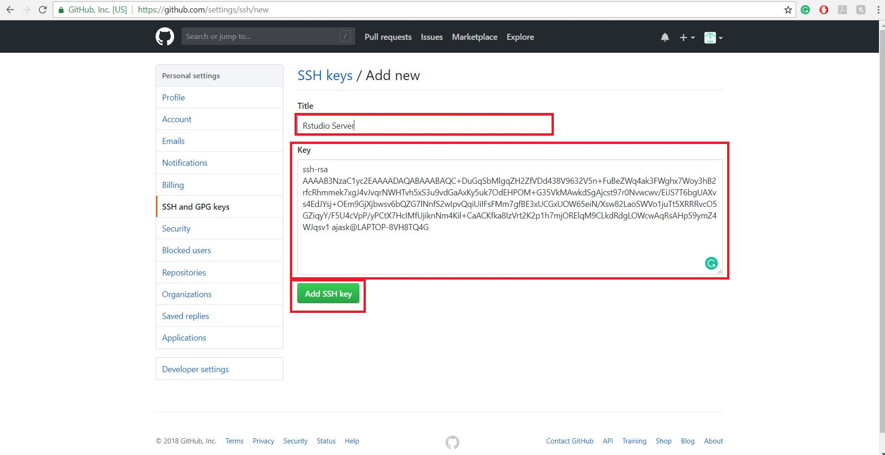
```

If all the steps were followed correctly, then you will see a key in SSH keys section.

```{r ssh-key-step_11, click.img = TRUE}
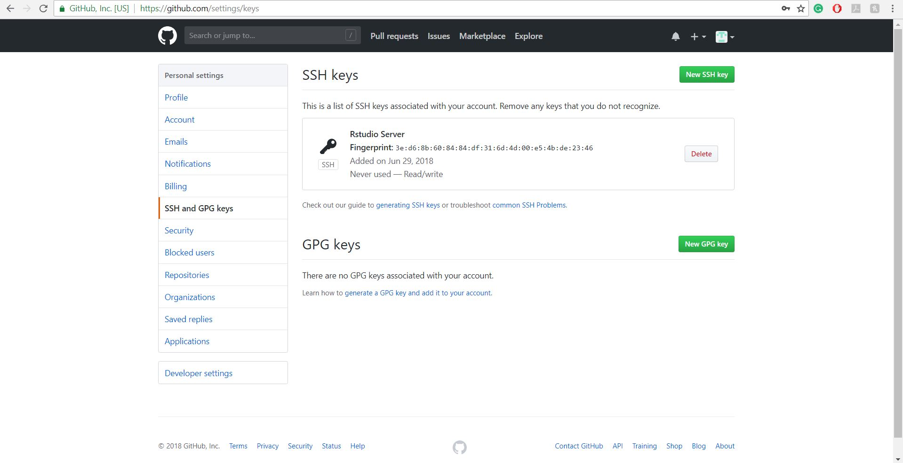
```

**If you have any questions or concerns, then please contact your instructor.**

## Interacting with your files on RStudio Server

In RStudio Server it is easy to interact with your files. We can easily upload, delete and rename the files from the menu which is present in the lower right window.

```{r interacting_step_1}
knitr::include_graphics("img/interacting_step_1.png")
```

### Setting path for the working directory

Before starting interacting with files, it is essential to set the path of the working directory. This can be done by selecting More option and then click on Set As Working Directory. So whenever you upload or save any file that file will get stored in your working directory. Also, if you are in the different folder and you want to go in the working directory folder, then you can click on Go To Working Directory option.

```{r interacting_step_5}
knitr::include_graphics("img/interacting_step_5.png")
```

### Creating a folder

If you want to create a new folder, then click on New Folder option. It will ask you for the name which you would like to give to that folder and then press on Ok.

```{r interacting_step_2}
knitr::include_graphics("img/interacting_step_2.png")
```

### Uploading a file

If you want to upload any file, then click on Upload option and then upload a file from your local drive to your account on RStudio Server. Please note that you can only upload one file at a time. If you want to upload multiple files, then please create a .zip file and then upload.

```{r interacting_step_3}
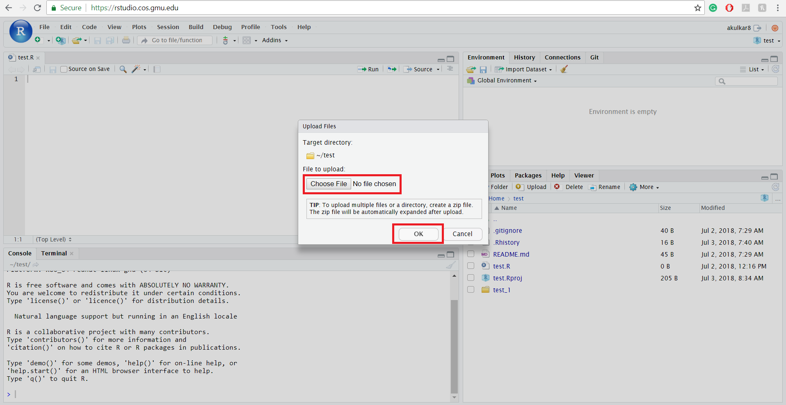
```

### Deleting or renaming a file

You can also delete or rename the file easily by clicking the options which are present in the lower right window. Before removing or renaming the file, it is mandatory to click the checkbox of the file which you would like to process. 

```{r interacting_step_4}
knitr::include_graphics("img/interacting_step_4.png")
```

### Viewing a file

First, you need to go to a folder in which the file is present. You can quickly switch from one folder to another folder by clicking on the path present in the lower right window (Home icon). To view a file, click on a file which you would like to see or edit and the file will open in the upper right window.

```{r interacting_step_6}
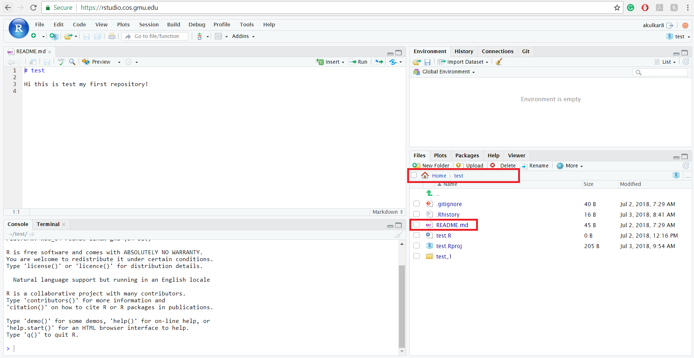
```

## Creating a new file on RStudio Server

To create a new file in RStudio Server, you need to click on File tab. In file tab click on New File and then you will see different formats of the file which you can create in RStudio Server. Select the appropriate file type, and then you will get a blank file which will open in the upper left window.   

```{r file_step_1}
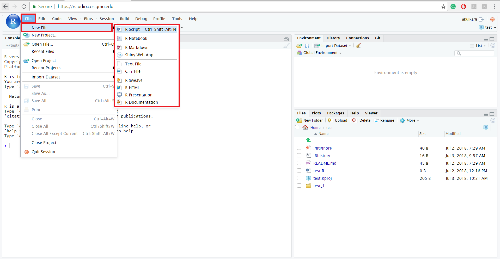
```

```{r file_step_2}
knitr::include_graphics("img/file_step_2.png")
```

## Using RStudio Server to clone a Github Repo as a new project

### Step - 1

Log in to your RStudio Server account on <https://rstudio.cos.gmu.edu/>. 

```{r clone_step_1}
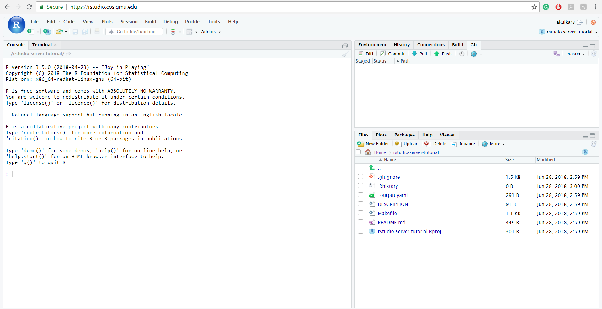
```

### Step - 2

In this tutorial, we will be creating a new project in RStudio Server to clone a GitHub repository. To create a new project click on the right side (cube containing R icon) button on RStudo Server screen. After clicking the button, you will see a menu and then click on "New Project...".

```{r clone_step_2}
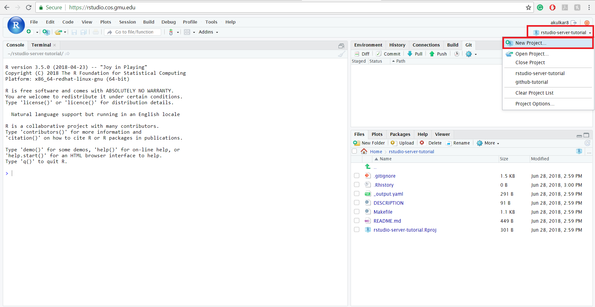
```

### Step - 3

A new window will open and select "Version Control" option from the window.

```{r clone_step_3}
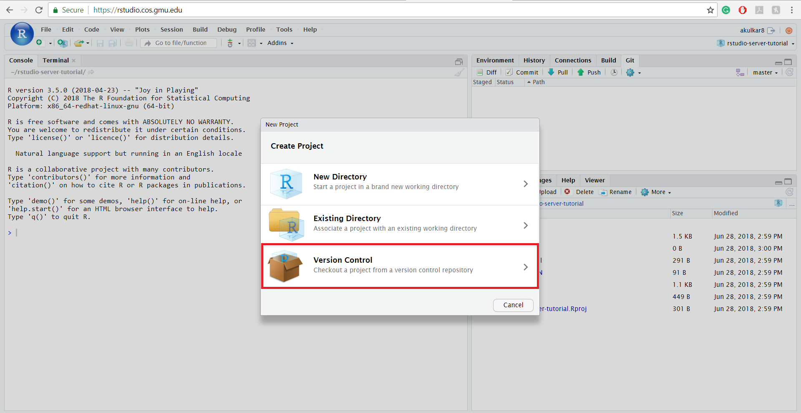
```

### Step - 4

Now, select "Git" option from the menu.

```{r clone_step_4}
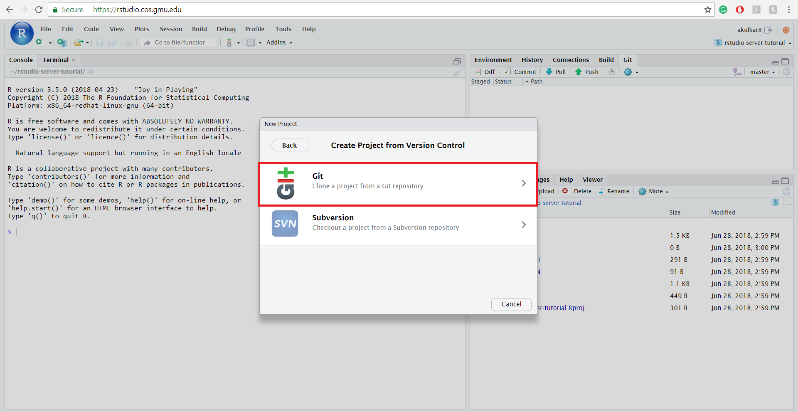
```

### Step - 5

In this step, you need to go to your GitHub account (<https://github.com>) and copy the URL of the repository which you need to clone. In this tutorial "test" repository will be used. (Please remember to copy the URL of the repository which you need to clone) 

```{r clone_step_5}
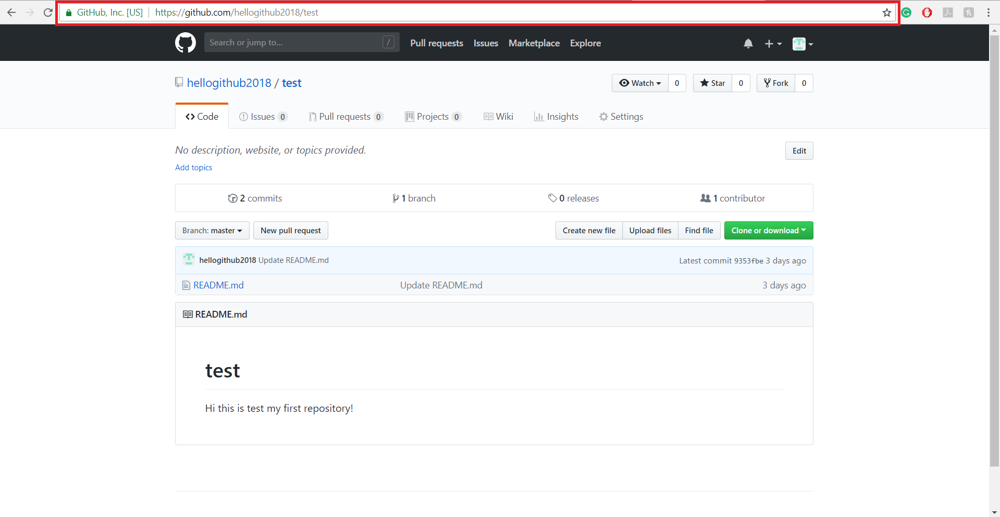
```

### Step - 6

In the last step, you have copied the URL from GitHub. Now, paste the URL in "Repository URL" textbox. RStudio Server will automatically use the same repository name from the URL and then click on "Create Project" button. 

```{r clone_step_6}
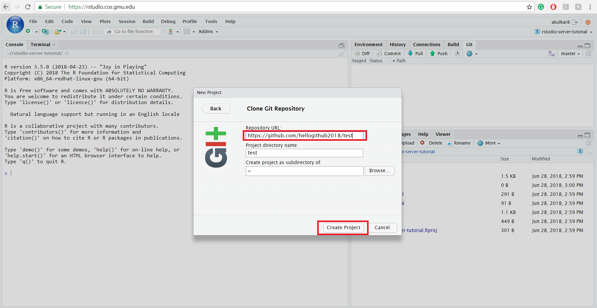
```

### Step - 7

You have successfully cloned a repository from GitHub in RStudio Server. After creating a project, you will be in the newly cloned repository. You can easily access the files from the repository in the lower right window. Also, if you want to verify the repository, then you can check it on right side (cube containing R icon) button in the RStudio Server. 

```{r clone_step_7}
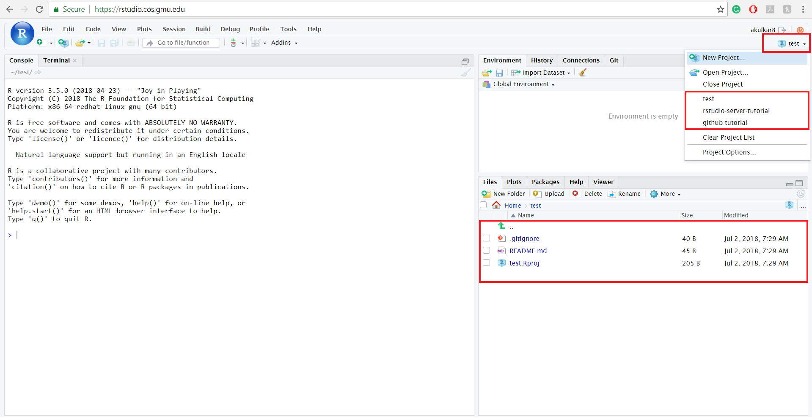
```

## How to stage, commit, and push to Github using RStudio Server

### Step - 1

Click on the "Git" which is present in the upper right window. After clicking the Git button, you will see a list of all files that have been changed since the last commit.

```{r stage_step_3}
knitr::include_graphics("img/stage_step_3.png")
```

### Step - 2

Click on the "Staged" checkbox to stage files which you want to push to GitHub and click on the "Commit".

```{r stage_step_4}
knitr::include_graphics("img/stage_step_4.png")
```

### Step - 3

A new window will open, and it will reflect you the files which you want to commit to GitHub repository. You can also write a commit message in the "Commit message" textbox and then click the "Commit" button. (DO NOT check the box which says "Amend previous commit" - this will only lead to disaster).

```{r stage_step_5}
knitr::include_graphics("img/stage_step_5.png")
```

You will see the following screen after clicking on the "Commit" button. Close the window by clicking the "Close" button. 

```{r stage_step_6}
knitr::include_graphics("img/stage_step_6.png")
```

### Step - 4

After committing the files on GitHub, you will find the upper right window empty. It means that you have committed the files to the repository. Now, in the final step, you need to click on "Push" to push the files in the repository. 

```{r stage_step_7}
knitr::include_graphics("img/stage_step_7.png")
```

### Step - 5

When you click the "Push" button, then RStudio Server will ask you for your GitHub username and password. Please give your details and then click on "Ok".

```{r stage_step_8}
knitr::include_graphics("img/stage_step_8.png")
```

In the end, you will see a new window containing Git Push message. If everything is correct, then there will not be any errors, and your files have been successfully pushed in GitHub repository. 

```{r stage_step_9}
knitr::include_graphics("img/stage_step_9.png")
```

### Step - 6

You can also crosscheck on GitHub by accessing the specific repository. 

```{r stage_step_10}
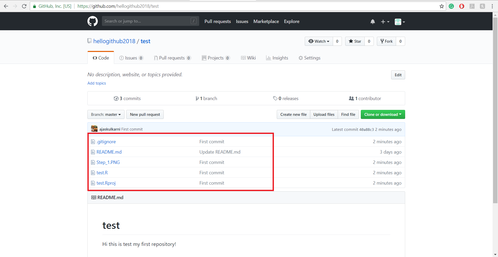
```

In this way, you can easily stage, commit and push to GitHub using RStudio Server. If you have any questions or concerns, then please contact your advisor.

## Switching between Github repos in RStudio Server

In the last tutorial, we learned how to clone a repository from GitHub to RStudio Server. Now, we will see how to switch from one repository to another in RStudio Server. 

### Step - 1

Log in to your RStudio Server account on <https://rstudio.cos.gmu.edu/>. You can see your current repository on the right side (cube containing R icon) button on RStudo Server screen. Currently, I am working in the "rstudio-server-tutorial" repository, and there are two other repositories which I have already cloned from GitHub ("test" and "github-tutorial").

To switch from one repository to another click on the right side (cube containing R icon) button and then click on the repository which you want to access. In this case, I want to move from "rstudio-server-tutorial" repository to "test" repository. (While performing tutorial, please note that you will have different repositories) 

```{r switch_step_1}
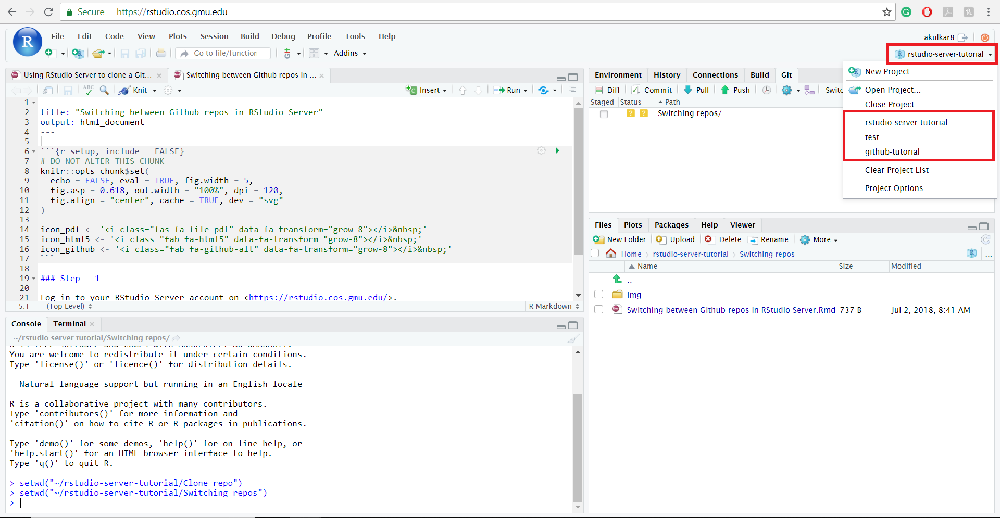
```

### Step - 2

After clicking on the name of the repository, RStudio Server will switch to the respective repository. You can verify the repository by checking its name on the right side button.

```{r switch_step_2}
knitr::include_graphics("img/switch_step_2.png")
```

In this way, you can quickly switch from one repository to another in RStudio Server. If a particular repository is not available in RStudio Server then first you need to clone that repository from GitHub, and then you can use that repository in RStudio Server.

## How to submit your homework assignment using Pull Requests

### Step - 1

Log in to your GitHub account on <https://github.com/> and go into the repository which you would like to submit. Click the "Pull Requests" tab near the top of the page. 

```{r pull_step_1}
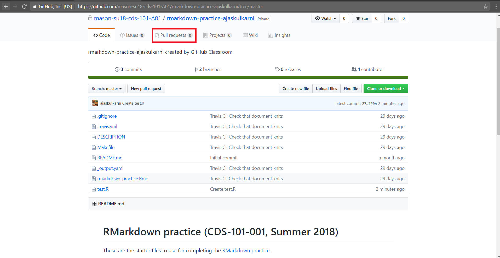
```

### Step - 2

Click the green button that says "New pull request".

```{r pull_2}
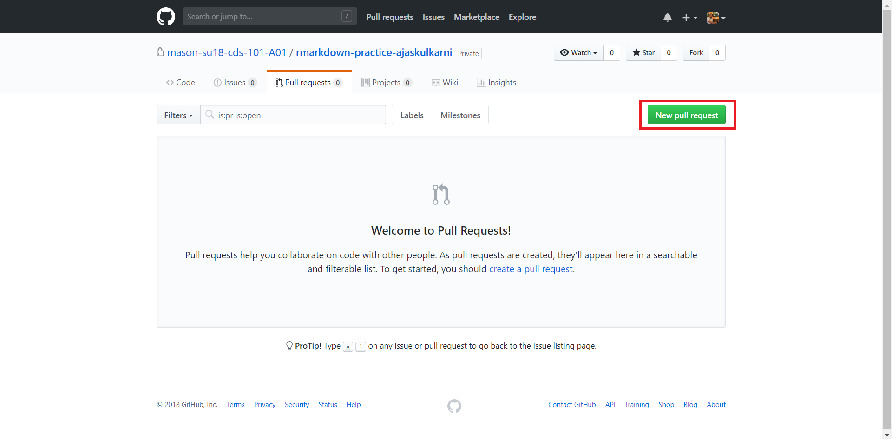
```

### Step - 3

Click the drop-down menu button labeled "base:", and select the option starting.

```{r pull_3}
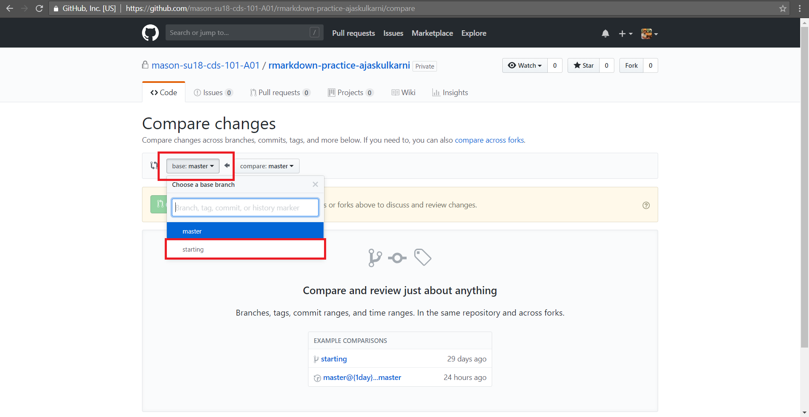
```

### Step - 4

Confirm that the drop-down menu button labeled "compare:" is set to master and click the green button that says “Create pull request”.

```{r pull_4}
knitr::include_graphics("img/pull_step_4.png")
```

### Step - 5

Give the pull request the following title: Submission: Homework 1/2/3/4, FirstName LastName, replacing FirstName and LastName with your actual first and last name. 

In the message box, write: My homework submission is ready for grading @jkglasbrenner and click "Create pull request" to lock in your submission.

```{r pull_step_5}
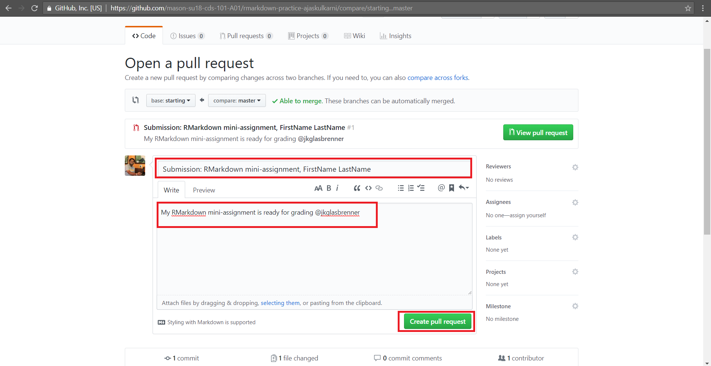
```

### Step - 6

After submitting the pull request, you will able to see the title and message which you wrote for submission.  

```{r pull_step_6}
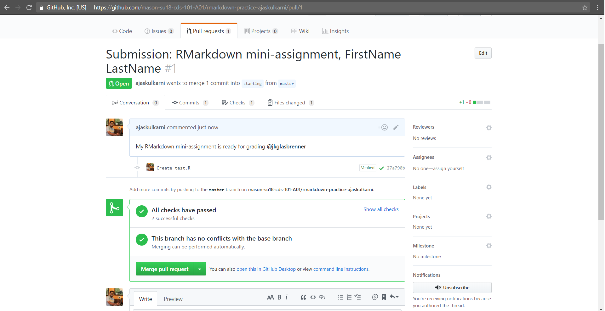
```

## Other common questions about RStudio Server

### What happens if you close the browser tab?

RStudio Server can be accessed via web browser after authenticating the user. If you are working in RStudio Server and mistakenly close the browser, then it will not affect your computations or saved files. You will see the same screen which you have closed after starting the RStudio Server again.

### I clicked "import dataset," but I can't find the file I downloaded, where is it?

RStudio Server stores data and code files on the cloud. Whenever you will upload any new file/data or save your code in RStudio Server, then it will store those files in the cloud and not on your local drive. 

Also, please note that after uploading files you will be making changes in the files which are uploaded to the cloud. Similarly, if you are using any data set in RStudio Server, then you will be using that from the cloud. 

If you would like to have a copy of your work on your local drive, then download that by selecting the "More" tab (lower right window) and then click on "Export..."

```{r question_step_2}
knitr::include_graphics("img/question_step_1.jpg")
```
